# Slice 6F: Design Studio Acceptance / Integration Walkthrough

**Status:** complete. One real, end-to-end browser walkthrough of the canonical test kitchen, driven entirely
through the Design Studio UI (Playwright + Chromium against a live `pnpm pilot:demo`), no API/JSON/DB
shortcuts. This is an acceptance test, not a design doc: it records what a Lintel designer would actually hit
using Slices 6A–6E as they stand today, judged like a product review, not a pass/fail unit test.

**Verdict up front:** PARTIAL. The core loop — place cabinets, edit them, see Plan/Elevation/3D/Validation stay
in sync, generate a BOM, reload the page — works, with 0 unintended BLOCKERs and full persistence. But three
things fall short of "a designer could just use this": Elevation only ever shows wall A (the whole return wall
is invisible in Elevation, always), there is no in-UI way to set a cabinet's finish/material, and one ordinary
user action (an out-of-range width on a filler/panel) reproducibly whites out the entire screen. Details below.

**Environment:** `pnpm pilot:demo --reset` (LOCAL, `lintel_rehearsal` database), API on `:3000`, UI on `:5173`,
19 rehearsal reference-data files (all APPROVED / `TEST_FIXTURE`). Browser: the pre-installed Chromium at
`/opt/pw-browsers/chromium`, driven by a Playwright script written for this walkthrough (not committed —
this report and its screenshots are the deliverable). Screenshots are under `.slice6f-screenshots/` at the
repo root, referenced below as `../../.slice6f-screenshots/<name>.png`.

---

## 1. The canonical kitchen, as built

Room: **4000 mm** (wall A) × **3000 mm** (depth, walls B/D) × **2700 mm** high, **120 mm** wall thickness (chosen —
not specified by the brief). Wall A is the main wall; wall D is the return wall. The L-corner sits at the `D-A`
corner (the corner id whose two legs are wall D and wall A — the only corner that connects the two walls named
in the brief).

All eleven objects, as the resolved model reports them after the full walkthrough (object code → product →
wall → position → width):

| Code | Product | Wall | Along (mm) | Width (mm) | Note |
|---|---|---|---|---|---|
| BC-001 | `KIT_BASE_STANDARD` | D | 2400–3000 | 600 | corner return leg (INSET overlay, per corner geometry) |
| BC-002 | `KIT_BASE_STANDARD` | A | 560–1160 | 600 | corner front leg (INSET) |
| BC-003 | `KIT_BASE_STANDARD` | A | 1160–1760 | 600 | 600 shutter base |
| BC-004 | `KIT_BASE_DRAWER` | A | 1760–2660 | 900 | 900 drawer base, 4 drawers (edited from 3, §C13) |
| BC-005 | `KIT_BASE_SINK` | A | 2660–3260 | 600 | 600 sink base |
| BC-006 | `KIT_BASE_PULLOUT` | A | 3260–3560 | 300 | 300 pull-out |
| BC-007 | `KIT_BASE_HOB` | D | 0–600 | 600 | 600 hob base, appliance `HOB_REFERENCE_60CM` |
| BC-008 | `KIT_TALL_OVEN` | D | 600–1200 | 600 | 600 oven tower, height 2000 mm, appliance `OVEN_REFERENCE_60CM` |
| BC-009 | `KIT_BASE_OPEN` | D | 1200–2100 | 900 | open/shelf cabinet |
| BC-010 | `KIT_FILLER` | D | 2100–2400 | 300 | filler closing the wall-D gap before the corner |
| BC-011 | `KIT_END_PANEL` | A | 3565–3605 | 40 | end panel finishing the pull-out's exposed side (edited from 18mm, §C12; moved 5mm off flush, §F35) |

Wall A run: corner leg + shutter + drawer + sink + pull-out + end panel = one continuous run, 560→3605mm (length
3045mm after the §C/§F edits). Wall D run: hob + oven + open + filler + corner leg = one continuous run,
0→3000mm (fills the whole return wall exactly, length 3000mm). The `KIT_FILLER`/`KIT_END_PANEL` widths are
real, catalog-pinned limits, not arbitrary: the rehearsal catalog gives fillers 20–300mm and end panels
10–50mm (`apps/db-tools/src/pilot/rehearsal-dataset.ts:139-140`) — a filler is a narrow strip and an end panel
a thin skin, never a wide gap-closer, which is why the open cabinet on wall D is sized at 900mm (not 600mm) so
the leftover before the corner is exactly the 300mm a filler can take.

---

## 2. Browser workflow performed

Traceable against the brief's A–H sequence; every action below is a real button click / form fill in the
Design Studio, driven by Playwright, no API calls used to build or edit the design (API calls were used only
read-only, to inspect the already-rendered model for verification — e.g. confirming the `CORNER` relationship
in §D below — never to create or change anything).

1. **A** — Logged in as SALES/SITE_ENGINEER/DESIGNER (LOCAL demo tokens), SALES created the client + project +
   team, SITE_ENGINEER created the 4000×3000×2700/120 room, DESIGNER opened Design Studio, created the design
   and a DRAFT version pinned to approved data.
2. **B** — Added the corner pair (`+ Add pair`, corner `D-A`) first (so the main run has somewhere to butt up
   against), then the four main-run cabinets in wall-A order (shutter/drawer/sink/pull-out), each widened to
   spec via the Properties panel and saved; then the hob and oven tower (added via `+ Add`, which always lands
   on wall A, then moved to wall D via the Position controls — see the friction note in §6); then the open
   cabinet and filler on wall D, then the end panel on wall A.
3. **C** — Widened the end panel (18→40mm), changed the drawer cabinet's drawer count (3→4), and looked for a
   finish/material control (none exists — read-only "Finish (from the resolved model)").
4. **D** — Read the "Run" section for a main-wall cabinet (6 of 6, contiguous), and confirmed the engine's
   `CORNER` relationship exists by reading the resolved model directly (the UI has no on-screen "Corner"
   readout — see §6); opened the Validation tab to record the clean baseline.
5. **E** — Inspected Plan, Elevation, 3D; selected the drawer cabinet in Plan, confirmed it highlighted in
   Elevation and 3D; selected the sink in Elevation, confirmed it highlighted in Plan and 3D; widened the sink
   (600→650mm), confirmed Plan/Elevation/3D/Properties all updated live, with no refresh — this edit also
   created the deliberate overlap used in §F.
6. **F** — Confirmed the resulting BLOCKER (`OBJECT_COLLISION`) appeared in the Validation tab immediately;
   clicked the issue, confirmed it selected the colliding cabinet in Plan; reverted the sink's width, confirmed
   the BLOCKER cleared automatically; moved the end panel 5mm off flush from the pull-out, confirmed a
   `WARNING` (`CABINET_GAP_NOT_TOUCHING`), not an error, appeared.
7. **G** — Generated a PRELIMINARY BOM from the Design Studio's own BOM tab and inspected the full payload.
8. **H** — Fully reloaded the browser (`page.reload()`, not client-side nav), re-selected the DESIGNER session,
   re-opened Project → Room → Design Studio, and confirmed the whole kitchen, the §C/§F edits and the
   validation state all matched exactly.

---

## 3. Section-by-section verdicts

### A. Room — **PASS**

Room creation is a single clean form; dimensions came back exactly as entered (4000/3000/2700/120), and the
walls render immediately in Plan.

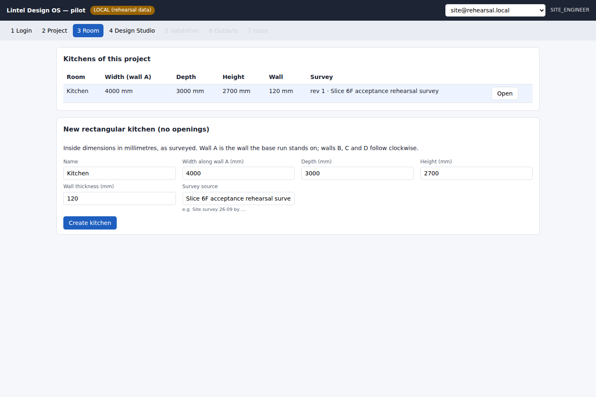

### B. Cabinet placement — **PARTIAL**

Every cabinet in the canonical kitchen was buildable through the library exactly as advertised — nothing
in the "confirmed available" list turned out to be unavailable in practice. The friction: **`+ Add` always
places the new cabinet on wall A** (`nextFreeX` in `apps/web/src/screens/DesignStudio.tsx:288`), regardless of
which wall the designer actually wants it on. Every one of the five return-wall cabinets (hob, oven tower,
open, filler, and implicitly the corner's own wall-D leg is the only exception, since the corner pair computes
both legs' positions directly) had to be added, then explicitly re-pointed at wall D via the Properties panel's
Wall/Along/Distance fields, then saved — two steps where a designer would expect one (e.g. "add to wall D"
directly from the library, or a drag-and-drop placement at add time). Slice 6A's drag-to-snap exists for
repositioning after the fact, but there is no way to choose the wall at creation time.

A second, sharper finding from this section: **entering a width outside a product's pinned catalog range
crashes the whole screen to a blank white page** — see §5 (Technical blockers). This was triggered while
exploring the filler's real limits, not in the final build (the final build only uses in-range widths), but
it is a single ordinary Properties-panel edit away for a first-time designer.

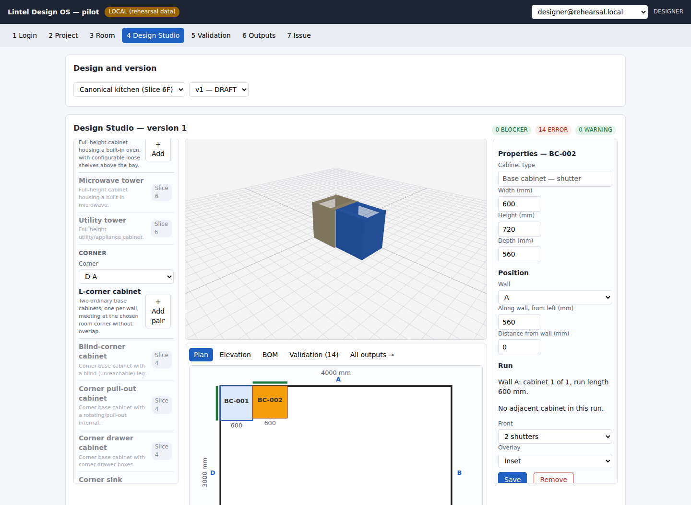

Also recorded: clicking `+ Add`/`+ Add pair` in the brief instant between "Create version" and the model's
first load throws a raw, untranslated error, "The room's model has not loaded yet." — the library buttons are
never disabled while the model is loading (`DesignStudio.tsx`'s `Studio` component, `addCornerPair`/`addCabinet`
guard on `m !== null` but the buttons themselves carry no `disabled` state tied to that). Minor, but a
first-click trap.

### C. Cabinet editing — **PARTIAL**

Width and drawer-count edits are both a single field change + Save, and both propagate immediately (run length,
front geometry). **Finish/material has no editable control anywhere in the Properties panel** — confirmed by
inspection: the only finish-related UI is a read-only `
` block ("Finish (from the resolved model)")
showing whatever the pinned product catalog's default carcass/back/front/finish ids happen to be, with disabled
inputs even for a single selected drawer front. A cabinet's finish is fixed the moment its product is pinned;
there is no per-cabinet choice a designer can make in this screen at all.

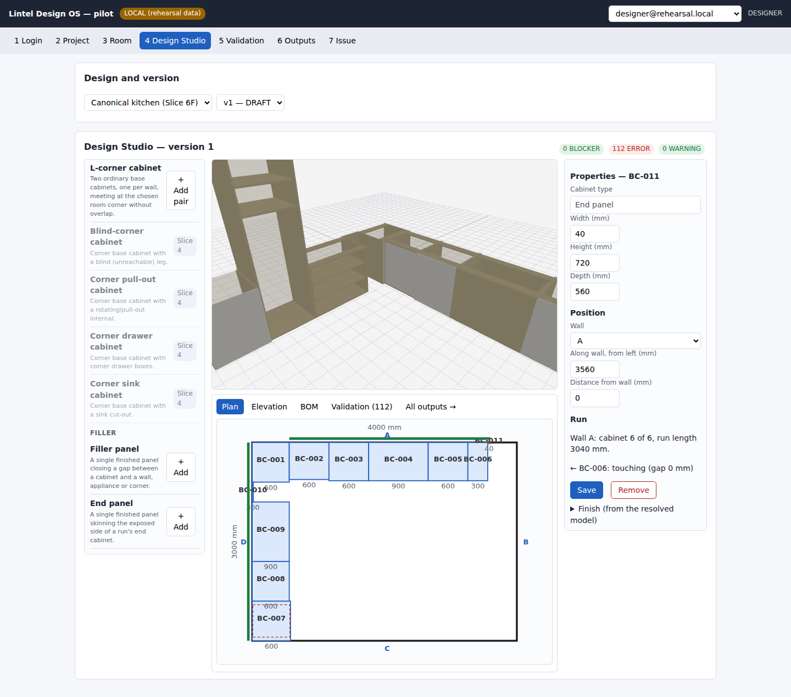
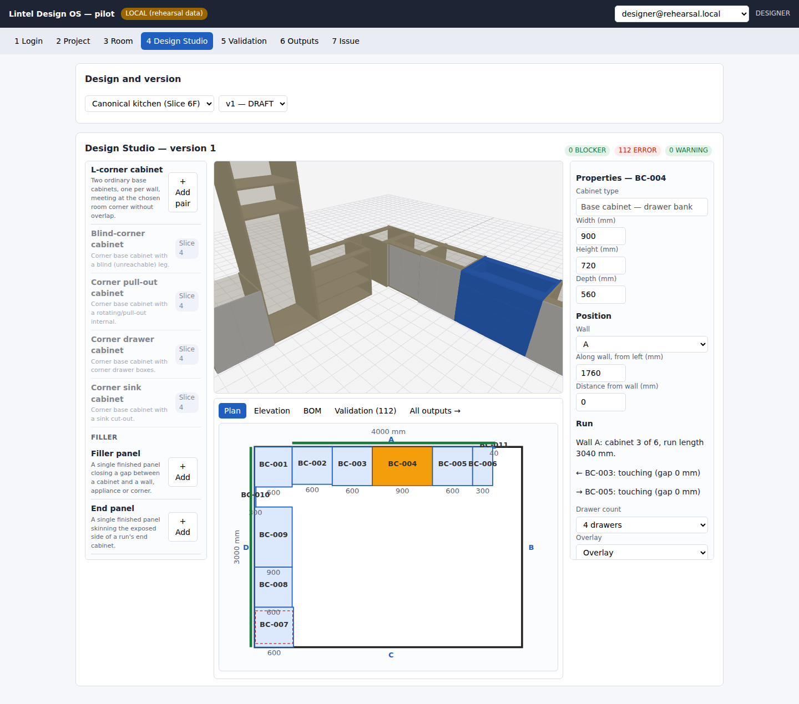
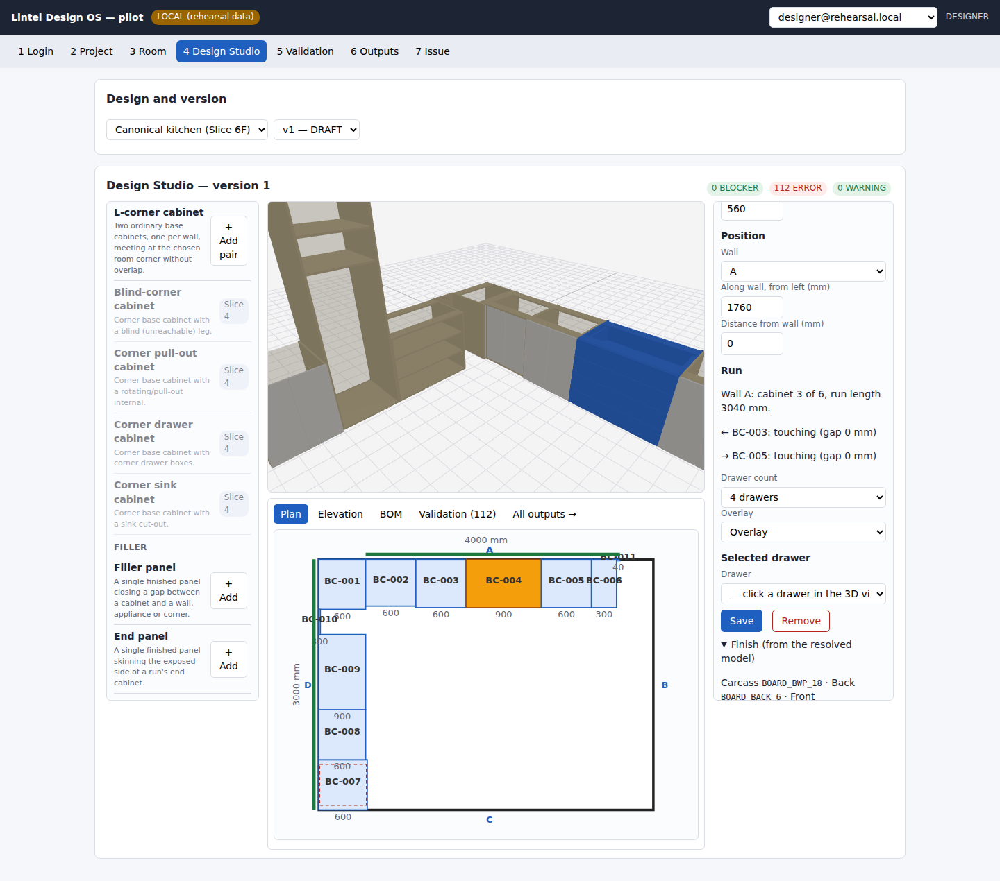

### D. Runs and snapping — **PARTIAL**

The "Run" section correctly reports "Wall A: cabinet 6 of 6, run length 3040mm" (and, symmetrically, wall D's
run as 5 of 5, length 3000mm, confirmed again after reload in §H). Reading the resolved model directly (GET
`.../model`, not a UI action) confirms the engine derives a real `CORNER` relationship for the two corner legs
(`{"type":"CORNER","wallIds":["D","A"],"gap":0,"touching":true}`). **The Properties panel never surfaces this**:
there is a "Run" section for same-wall adjacency, and nothing at all for the corner relationship — a designer
selecting a corner-leg cabinet gets no on-screen confirmation that it's correctly recognized as a corner pair,
only the visual fact that the two legs meet without a gap in Plan.

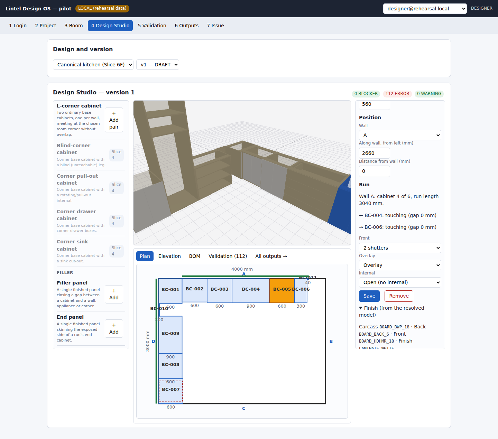

Validation confirmed 0 BLOCKER / 0 WARNING for our own placements at this point (112 pre-existing ERRORs — see
§6 for why those are a baseline, not something Slice 6F caused).

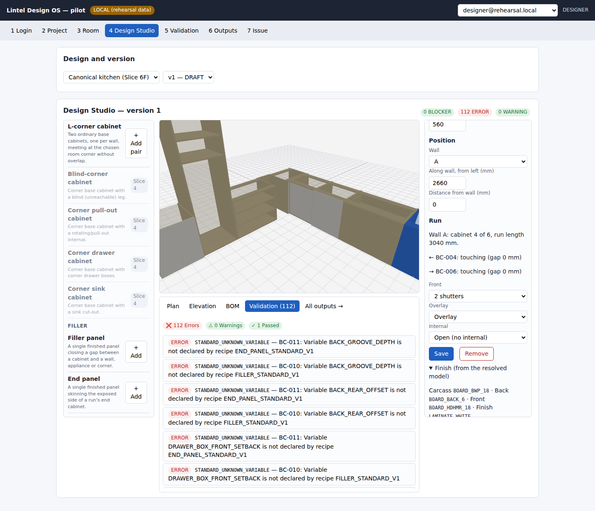

### E. Views — **PARTIAL**

Plan and 3D are both genuinely useful and stay in sync. **Elevation is hardcoded to wall A only**
(`apps/web/src/screens/Preview.tsx`'s `Elevation` component: `const onA = m.objects.filter((o) =>
o.placement?.wallId === "A")`) — there is no wall selector, so the entire return wall (hob, oven tower, open
cabinet, filler, and the corner's own return leg) can never be viewed in Elevation, under any circumstance, no
matter how the kitchen is laid out. For an L-shaped kitchen — the shape this very slice's own corner feature is
built for — half the elevation drawing is simply missing.

Cross-view selection sync itself is solid: selecting the drawer cabinet in Plan highlighted it (blue outline)
in Elevation and 3D; selecting the sink in Elevation highlighted it in Plan and 3D; widening the sink from 600
to 650mm updated its dimensions and the resulting overlap in Plan, Elevation, 3D and the Properties panel
simultaneously, with no manual refresh.

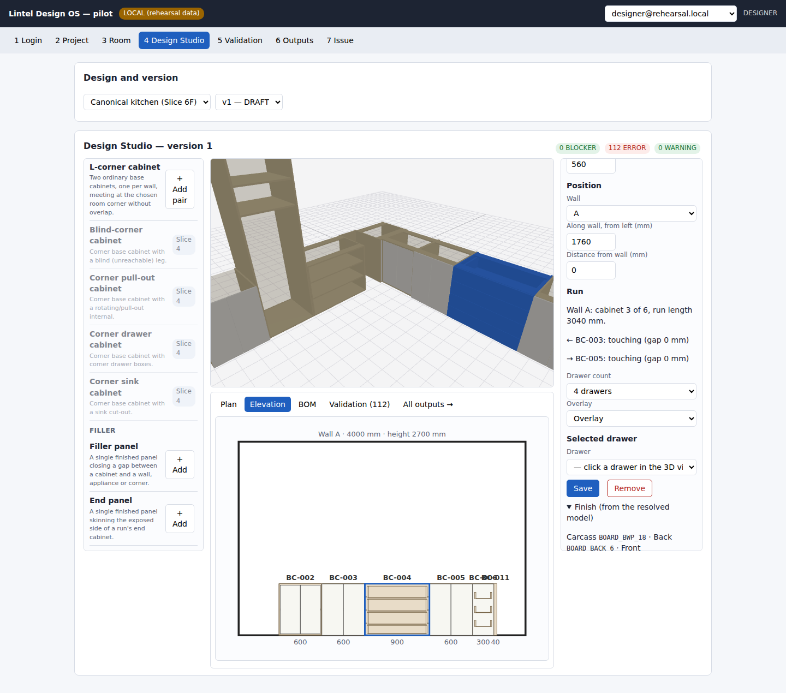
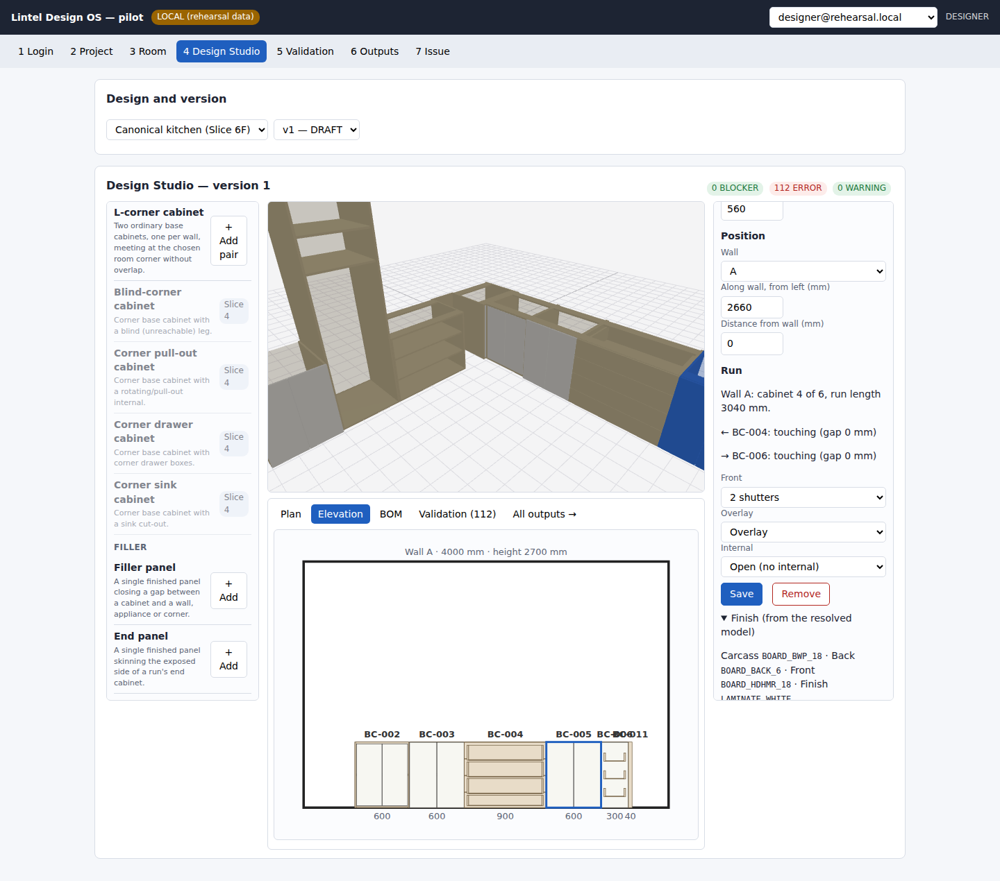

### F. Validation — **PASS**

This is the strongest section. Widening the sink to overlap the pull-out produced an immediate BLOCKER
(`OBJECT_COLLISION — BC-005 collides with BC-006, 0.000793 m³`) with no manual recheck; clicking the issue
switched to Plan and selected the correct colliding cabinet; reverting the width cleared the BLOCKER
automatically, back to the exact pre-edit count. Moving the end panel 5mm off flush from the pull-out produced
exactly a `WARNING` (`CABINET_GAP_NOT_TOUCHING`, "gap of 5mm — not snapped together; confirm this is
intentional"), never an error — the engine's three-tier gap logic (below `MIN_CABINET_GAP`=3mm is a BLOCKER,
above `MAX_GAP_WITHOUT_FILLER`=10mm is a different BLOCKER, and anything ≤30mm is this near-miss WARNING;
`packages/design-engine/src/room.ts:262-286`) behaved exactly as designed, and the UI reflected all of it live.

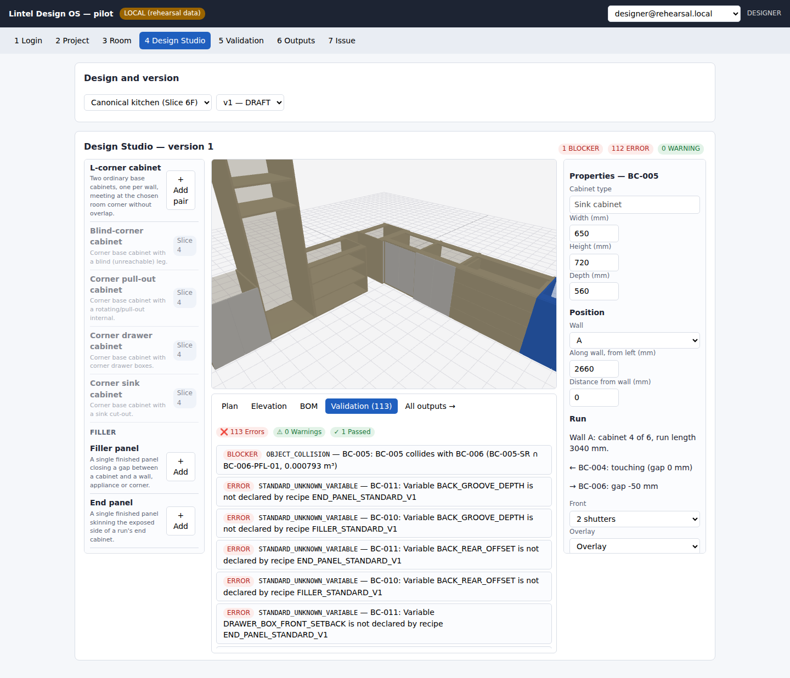
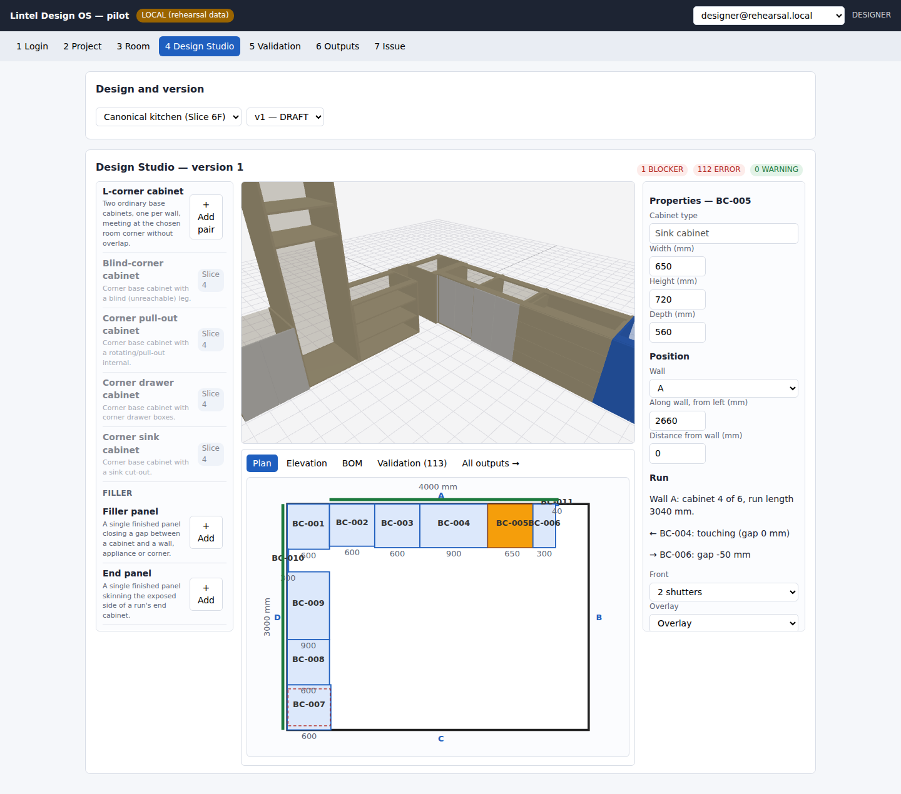
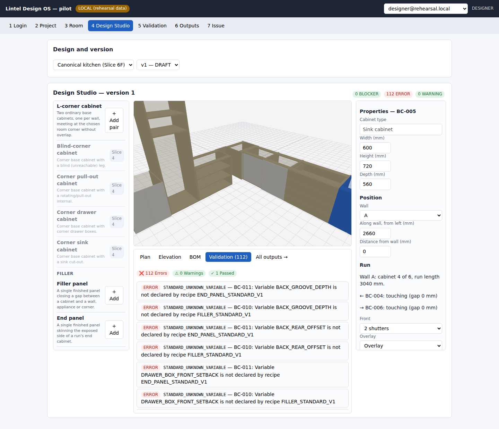
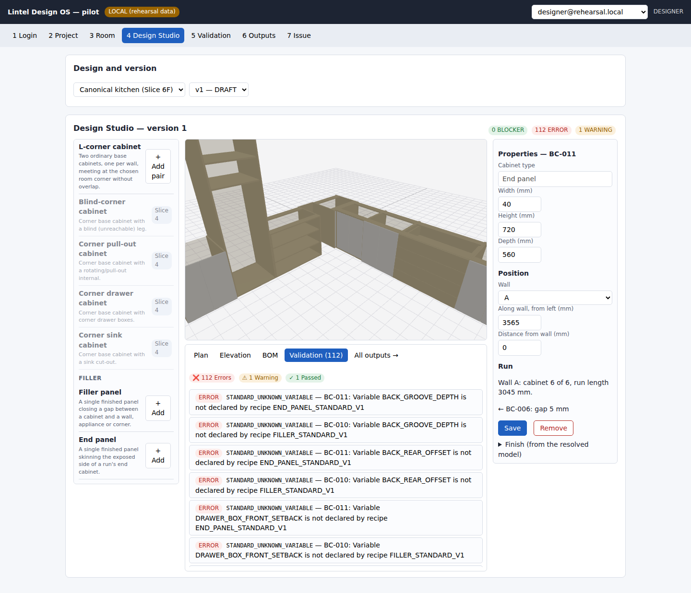

### G. Outputs (BOM) — **PASS**

"Generate BOM (PRELIMINARY)" produced a complete, `incomplete: false` payload matching what was actually built:
board areas for `BOARD_BWP_18` (carcass, 16.6 m²), `BOARD_BACK_6` (backs, 6.6 m²) and `BOARD_HDHMR_18` (2.9
m²); edge-band lengths for two profiles; `LAMINATE_WHITE` finished area; and real Hettich hardware quantities —
14 full-overlay hinges, 8 inset hinges, 22 mounting plates, 28 runner pairs (500mm) — all carrying the
`(LOCAL REHEARSAL ONLY)` marker. Per-object BOM lines confirm a `DRAWER_FRONT`/`DRAWER_BOX_SIDE`/runner set for
the drawer bank, a shutter+hinge set for every shutter door, and — importantly — a dedicated `APPLIANCE` line
for both the hob (`HOB_REFERENCE_60CM`) and the oven (`OVEN_REFERENCE_60CM`). **No `CUTOUT` line item appears
anywhere** (confirmed: every object's resolved `cutouts` array is empty) — a countertop sink/hob cutout is not
implemented; the hob and sink cabinets are represented as cabinets with an appliance reference, nothing more.

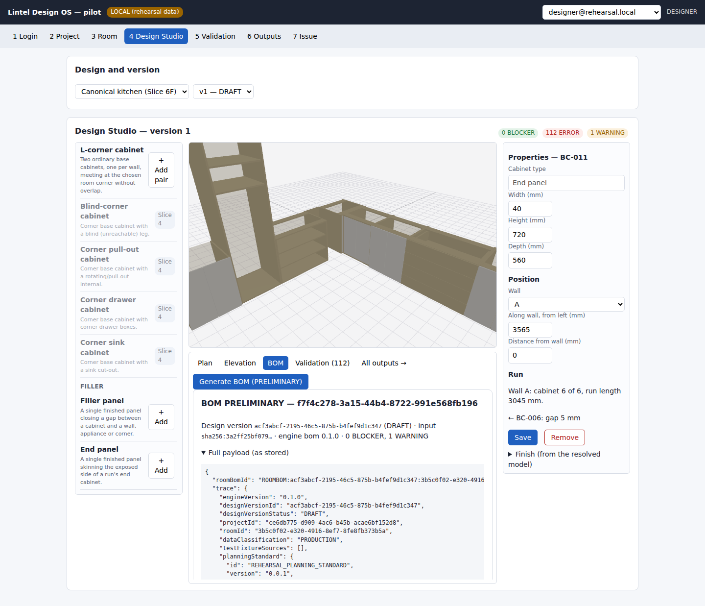

### H. Persistence — **PASS**

There is no manual "Save" per object — every Properties-panel "Save" click is itself the persistence step (a
PATCH to the API), and there is no separate save/publish step for the design as a whole. A full browser reload
(not client nav) followed by re-selecting the DESIGNER session and re-opening Project → Room → Design Studio
reproduced the entire kitchen exactly: all 11 objects, their exact widths/positions/rotations, the wall-A and
wall-D runs (identical lengths), the corner leg's INSET overlay, the drawer count (4), the end panel's edited
width (40mm) and its 5mm-off-flush position, and the validation state (0 BLOCKER, 112 pre-existing ERROR, 1
WARNING) — an exact match to the state left at the end of §F.

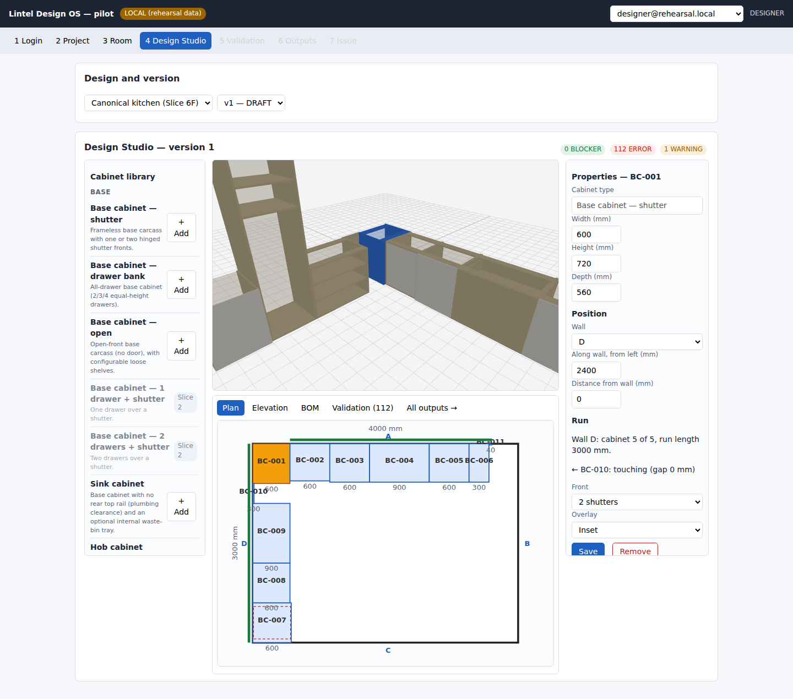
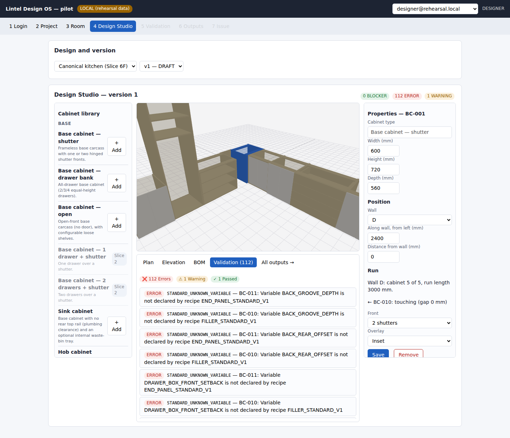

### Overall — **PARTIAL**

A real kitchen, matching the brief, was built entirely through the UI, edited, validated, reloaded and BOM'd,
with 0 unintended blockers throughout. Three things keep this from PASS: Elevation's wall-A-only limitation
(genuinely disqualifying for an L-shaped kitchen), the complete absence of a finish/material control, and the
severity of the out-of-range-width crash (§5).

---

## 4. Technical blockers found

**None stopped this walkthrough** (all were worked around by staying within valid inputs), but one is severe
enough to flag as a priority fix, not a polish item.

### Blocker candidate: an out-of-range Properties-panel width crashes the entire Design Studio

Reproduced twice, deterministically:

1. Add a Filler panel (or End panel) — default width 100mm (18mm for end panel), both in range.
2. In the Properties panel, set Width to a value outside the pinned product's catalog limits (rehearsal data:
   filler 20–300mm, end panel 10–50mm — `apps/db-tools/src/pilot/rehearsal-dataset.ts:139-140`) — e.g. 600mm for
   a filler — and click Save.
3. The PATCH succeeds (HTTP 200) and the API accepts and stores the out-of-range value. The resolved model then
   reports `PARAMETER_OUT_OF_RANGE` (BLOCKER) **and**, critically, `COMPONENT_NOT_GENERATED: width could not be
   computed (missing input W)` — the recipe produces **zero components** for that object, not a degraded one.
4. `decodeCabinetInstance` → `decodeFinish` (`packages/cabinet-engine/src/decode.ts:116-132`) special-cases
   `FILLER`/`END_PANEL` components (line 119: `findComponent(object, "FILLER") ?? findComponent(object,
   "END_PANEL")`), but when neither exists (because none were generated at all), it falls through to
   `requireComponent(object, "SIDE_LEFT")` (line 123), which throws (`decode.ts:58-62`): `Resolved object BC-00N
   has no SIDE_LEFT component; cannot decode it`.
5. This throw happens inside the Properties panel's render path (`DesignStudio.tsx:388`,
   `decodeCabinetInstance(selected, cabinetType)`), which is called unconditionally for whichever object is
   selected. There is no React error boundary anywhere in the app (`apps/web/src/App.tsx`). The result: **the
   entire page goes blank white** — not an error message, not a broken panel, the whole Design Studio.

Because the bad value was already persisted server-side, simply reloading does not recover: re-opening the same
version immediately re-triggers the same crash on the same object (it is very likely to be the auto-selected
object again). The only way out found during this investigation was to never save that value in the first
place; there was no in-UI recovery path once it had been saved. A test session that stumbles into this
one input — plausible, since nothing in the Properties panel indicates a width limit exists until after Save —
would lose the whole editing session for that version.

**Recommendation:** (a) validate width/height/depth against the pinned product's declared parameter limits
client-side, before Save, with a visible message (the limits are already in the resolved model's parameters,
just not checked here); (b) make `decode.ts`'s `decodeFinish`/front/internals decoders degrade gracefully when
a resolved object has zero components (show "this cabinet could not be resolved — see Validation" instead of
throwing); (c) add a top-level React error boundary regardless, so no single object's decode failure can blank
the entire screen.

No other blocker was found. Every other validation message encountered (112 baseline `STANDARD_UNKNOWN_VARIABLE`
ERRORs) is a pre-existing, structural gap between the shared `REHEARSAL_CONSTRUCTION_STANDARD` (which declares
variables for every recipe combined) and each individual recipe (which only declares the subset it uses) —
confirmed present on **every** object regardless of type or edit (BC-001/002, the two identical corner legs
using the exact same recipe the base pilot workflow itself uses, each independently contribute 7 of these), at
0 BLOCKER and 0 WARNING throughout Sections A–E. This is baseline noise inherent to the rehearsal fixture data,
not something Slice 6F introduced — the task's own `REHEARSAL.md` success criterion is "0 BLOCKERs", which this
build met throughout.

---

## 5. UX / product gaps (friction points)

- **Wall choice at cabinet-add time.** `+ Add` always lands on wall A; placing a cabinet on any other wall is a
  two-step add-then-reposition, for every single cabinet not on the main wall. (§B)
- **No finish/material control.** The Properties panel shows finish read-only, "from the resolved model" — a
  designer cannot choose a laminate, board or finish for any cabinet from this screen, ever, even though the
  pinned product catalog clearly defines those as parameters. (§C)
- **No corner-relationship readout.** The engine computes and can report a real `CORNER` relationship; nothing
  in the UI shows it. A designer has only the visual "the two legs touch in Plan" as confirmation. (§D)
- **Elevation is wall-A-only, permanently.** Not a rendering bug for this particular kitchen — a structural
  limitation of the Elevation component itself. Any cabinet on any other wall (i.e. an entire return wall, in
  any L- or U-shaped kitchen) is simply never drawable in Elevation. (§E)
- **The width-range crash.** Covered in §4 — also a UX issue in its own right: nothing in the Properties panel
  hints that a width limit exists before Save silently accepts an invalid value.
- **The model-not-loaded-yet error.** A raw, developer-facing error string reachable by an ordinary fast click
  right after creating a version. (§B)

### Product-review answers

1. **Is adding a cabinet intuitive?** Mostly — one click from the library, defaults are sensible. Undercut by
   always landing on wall A regardless of intent.
2. **Is selecting a cabinet obvious?** Yes — clicking in Plan, Elevation (on wall A) or 3D all work and agree
   with each other immediately.
3. **Is changing width/height/depth easy?** Yes, a plain numeric field + Save, with immediate visual and
   validation feedback — undermined only by the missing range-check (§4).
4. **Is switching shutters/drawers intuitive?** Yes for drawer count (a simple select) and shutter count (1 vs 2
   via a Front select); there is no way to switch a cabinet's family (e.g. shutter → drawer) after creation,
   which is reasonable — that is a different product, not a property.
5. **Is the cabinet run easy to understand?** Yes — the Run section's "cabinet N of M, run length X, gap to
   neighbour Y" reads naturally and updated correctly through every edit tested.
6. **Does corner behavior make sense?** Geometrically, yes — the two legs meet exactly, no gap, no overlap, any
   of the 4 corners. It is not explained anywhere in the UI *why* it's correct (no Corner readout, §D).
7. **Does Plan feel useful?** Yes — this is the most complete, most trustworthy view in the whole studio.
8. **Does Elevation feel useful?** Only for a single-wall kitchen. For the canonical L-shaped kitchen this
   brief asked for, it shows five of eleven objects and silently omits the rest — actively misleading if read
   as "the elevation" without knowing this limitation.
9. **Does 3D feel useful?** Yes, as an orientation/sanity-check view (orbit/pan/zoom, correct box colors,
   correct selection highlight) — not detailed enough to replace Plan or Elevation, which is a reasonable
   division of labour, not a flaw.
10. **Does validation help rather than distract?** Yes for BLOCKER/WARNING (clear, actionable, click-to-select);
    the 112 baseline ERRORs are real noise that would need explaining to a first-time user, even though they
    are harmless and pre-existing (see §4).
11. **Does the BOM correspond to what was actually designed?** Yes, precisely — board areas, edge-band lengths,
    hardware counts and appliance references all matched what was actually built and edited, with `incomplete:
    false`.
12. **Does the whole experience feel like a cabinet-design application, or an engineering/debugging tool?** A
    genuine hybrid, currently tilted toward engineering: Plan/3D/BOM feel like a real design tool; the
    Properties panel's raw parameter fields, the read-only "resolved model" framing throughout, and the
    STANDARD_UNKNOWN_VARIABLE-style validation noise all read as instrumentation for the people building the
    engines, not (yet) a polished surface for the people designing kitchens.

---

## 6. Performance notes

Only what was actually observed, nothing speculative:

- Cabinet placement (both `+ Add` and `+ Add pair`) and Properties-panel saves each completed in well under a
  second — no perceptible lag across 11 objects and roughly a dozen edits.
- View switching (Plan ↔ Elevation ↔ BOM ↔ Validation) was instant; no re-render stutter.
- Cross-view selection sync (Plan → Elevation/3D and back) was immediate, no visible delay.
- The 3D viewport (Three.js/WebGL) rendered correctly in headless Chromium throughout, including after
  selection changes and width edits — no visual glitches, no stale frames observed.
- The one real, reproducible timing gap: clicking a library "+Add" button in the short window between
  "Create version" and the model's first `GET .../model` response throws the raw error described in §5/§B —
  this is a correctness/UX gap, not a performance one (the load itself was fast; the gap is that the button
  isn't disabled meanwhile).
- No broken selection, no visual glitches, and no slow reload were observed: the full-page reload in §H
  (Section H) returned the app to a working, fully-synced state within about 1.5 seconds of the reload
  completing.

---

## 7. Recommended next product priorities

Ranked by (severity × how directly it blocks a real designer):

1. **Fix the out-of-range-width crash** (§4) — a data-entry mistake should never blank the whole application;
   this is the one finding here that rises to "must fix soon", not "nice to have".
2. **Give Elevation a wall selector** (or otherwise draw more than wall A) — the single biggest gap between
   "views" and "a designer can actually check their kitchen": right now an L/U-shaped kitchen's Elevation
   drawing is incomplete by construction, not by omission-in-this-build.
3. **Add a finish/material control to the Properties panel** — even a simple picker sourced from the same
   catalog the pinned product already resolves against would close the single largest "this doesn't feel like
   a design tool yet" gap (product-review Q12).
4. **Let a cabinet be added directly to a chosen wall** (or via drag-and-drop placement at add time), removing
   the two-step add-then-reposition dance for anything not on wall A.
5. **Surface the corner relationship** in the Properties panel (a one-line "Corner: touching wall X" alongside
   the existing "Run" section) — cheap, and closes a real confidence gap for L-shaped layouts.
6. **Disable/queue library buttons until the model has loaded**, to remove the raw-error first-click trap.
7. **Consider a countertop cutout representation** (sink/hob) if that's on the roadmap — currently there is
   none (confirmed, §G) — lower priority than the above since it wasn't claimed as available for this slice.

---

## 8. Can a Lintel designer now design a real kitchen in this system?

**Mostly yes, with real caveats.** Everything the canonical brief asked for — a rectangular room, a four-cabinet
main run, an L-corner, a two-cabinet return wall, an open/shelf cabinet, and a filler/end panel closing both
run ends — was built, start to finish, through ordinary clicks and form fills in the Design Studio, with **zero
unintended validation issues** at any point. Editing (width, drawer count), cross-view selection, deliberate
overlap/warning testing, BOM generation and a full page reload all behaved exactly as a working CAD-lite tool
should: fast, synchronized, and durable.

What works and feels good: Plan is trustworthy and complete; 3D gives real spatial confidence; the Run section
explains adjacency in plain language; Validation is precise, actionable, and click-to-select; the BOM matches
the design exactly, down to Hettich hardware counts and appliance references.

What is awkward: adding any cabinet to a wall other than A always takes two steps, not one; there is no
in-UI confirmation of the corner relationship a designer is relying on; and one wrong number in a width field
can — right now — take down the whole screen with no visible warning beforehand.

What is missing outright: a finish/material choice anywhere in this screen, and a usable Elevation for any wall
but A — which, for the L-shaped kitchen this exact brief describes, means the return wall (hob, oven tower,
open cabinet, filler) can never be checked in elevation at all, only in Plan and 3D.

So: a designer *can* build this exact kitchen today, and would likely finish it without giving up. But they
would hit real friction doing it (wall-A-only add, wall-A-only elevation, no finish control), and — if unlucky
with one width value — a hard crash with no recovery path. The engineering underneath (runs, corners, gaps,
BOM, persistence) is genuinely solid; the remaining gap is entirely in the last mile of the designer-facing
surface, and the priority list in §7 above is exactly that last mile.
