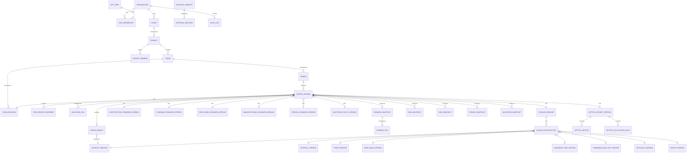

# M5 Technical Design: Persistence, Versioning and Approval Workflow

Status: **PROPOSED, awaiting approval** (2026-09-26). Nothing here is implemented.
No migrations are written, no Supabase project is touched, and no canonical database is chosen.

Base: `main` at `cdc5914` (M4 merged). PRD §35 (version control), §36 (API), §38 (audit), §39 (security) and
§40 (multi-tenant) apply. The companion document
[PRODUCTION-DATA-ARCHITECTURE.md](PRODUCTION-DATA-ARCHITECTURE.md) defines the standards and catalog domains.

---

## 0. Governing rules

1. **The engines stay authoritative.** The database stores inputs, approved versions, snapshots and audit
   history. It never calculates geometry, construction, BOM, BOQ, price, drawings or production eligibility.
   No SQL function or trigger reproduces engine logic. The legacy `generate_module_boq` stays frozen (ADR-0002).
2. **Engines never import a database client.** This is already enforced by ESLint `no-restricted-imports` (ADR-0003).
   Persistence is a new adapter package, `@lintel/persistence`, that maps rows to engine types and back.
3. **Snapshots are computed by the server, never accepted from a client.** A client can ask for a snapshot.
   The API loads the pinned inputs, runs the engines, verifies the result and writes it.
4. **TEST_FIXTURE data never enters the database.** Fixtures stay in code and tests. Every persisted data row is
   `PRODUCTION`, enforced by a CHECK constraint, and production values stay `NULL` until approved.
5. **There is no generic `Standard` table** and no generic `configuration` object. Each standard and each catalog
   domain has its own tables, columns and approval route (see the companion document).
6. **Locked means immutable.** Enforcement happens in the database (triggers and revoked privileges), not only in the API.
7. **Production stays blocked.** M5 adds no data and relaxes no guard. Approval requires an engine validation run
   with zero BLOCKERs, which cannot happen until real production data is approved.

---

## 1. Entity relationship map



Three families of tables:

| Family | Tables | Mutability |
|---|---|---|
| Tenancy and people | organization, app_user, org_membership, client, project, project_member | Ordinary rows, audited |
| Versioned reference data | the six standards, the catalog domains, Hettich datasets, catalog releases | A header row plus immutable version rows |
| Design and outputs | room, room_revision, design, design_version, design_object, relationship_override, validation_run, the five snapshot tables, drawing_file | Versions are immutable once out of DRAFT; snapshots are insert-only |

Cross-cutting tables are approval_request, approval_decision and audit_log.

---

## 2. Table definitions

Everything sits in a dedicated Postgres schema, **`design_os`**, so it never collides with the ops `public` tables
and can be dropped as a unit (see §13). The conventions are:

- The primary key is `id uuid` (v7, time-ordered). Human codes are unique per scope, for example `project_code` per org and `object_code` per design version.
- Every tenant-owned table carries `org_id uuid not null`. Foreign keys are **composite with `org_id`**, for example
  `foreign key (org_id, project_id) references project (org_id, id)`, so a row can never point into another tenant.
- Lengths are `integer` millimetres where the engine uses whole millimetres; otherwise `numeric(10,2)`. Money is `bigint` paise.
  Percentages are `numeric(5,2)`. Timestamps are `timestamptz`.
- `created_at` and `created_by` are on every table. `row_version integer` is used for optimistic concurrency (exposed as an ETag).

### 2.1 Version envelope (shared column set, not a shared table)

Every **versioned production record**, whether a standard version, catalog item version, Hettich dataset version,
catalog release or design version, carries the same columns. Each domain has its own table; the envelope is a
column convention checked by a shared constraint template in the migration, not a parent table.

| Column | Type | Rule |
|---|---|---|
| `version_no` | integer | Unique per header, assigned by the server, gap-free |
| `version_label` | text | Optional human label, e.g. `2026.1` |
| `status` | `record_status` | `DRAFT`, `IN_REVIEW`, `APPROVED`, `LOCKED` or `SUPERSEDED` (see §4) |
| `classification` | text | `CHECK (classification = 'PRODUCTION')`; fixtures never persist |
| `source` | text not null | Document, drawing, supplier sheet or official URL |
| `source_ref` | jsonb | Structured source: url, document title and version, source date |
| `change_reason` | text not null | Why this version exists |
| `content_sha256` | text not null | SHA-256 of the canonical (`stableStringify`) content |
| `submitted_by`, `submitted_at` | uuid, timestamptz | Set on DRAFT → IN_REVIEW |
| `approved_by`, `approved_at` | uuid, timestamptz | `CHECK` non-null when status is APPROVED, LOCKED or SUPERSEDED |
| `effective_from` | timestamptz | `CHECK` non-null when APPROVED or later |
| `locked_by`, `locked_at` | uuid, timestamptz | Set on APPROVED → LOCKED |
| `superseded_by` | uuid (self-FK) | `CHECK` non-null when SUPERSEDED |
| `superseded_at` | timestamptz | |

`effective_to` is not stored. It is the `effective_from` of the version named in `superseded_by`.

### 2.2 Tenancy and people

| Table | Key columns |
|---|---|
| `organization` | id, code (unique), name, status, `parent_org_id` (nullable, reserved for corporate → branch → franchise, PRD §40; unused in V1) |
| `app_user` | id (= `auth.users.id`), email, display_name, status |
| `org_membership` | org_id, user_id, role (`design_os_role`), status, granted_by, granted_at; unique (org_id, user_id, role) |
| `client` | org_id, client_code, name, contact (jsonb, minimal PII), `ops_lead_ref` text (nullable, informational, no FK) |
| `project` | org_id, client_id, project_code (unique per org), name, site_address (jsonb), status, currency `INR`, unit_system `MM`, `ops_project_ref` text (nullable, no FK) |
| `project_member` | org_id, project_id, user_id, project_role (`LEAD`, `CONTRIBUTOR`, `VIEWER`) |

### 2.3 Rooms and designs

| Table | Key columns |
|---|---|
| `room` | org_id, project_id, name, room_type (`KITCHEN` in V1) |
| `room_revision` | org_id, room_id, revision_no, length_mm, width_mm, height_mm, wall_thickness_mm, walls (jsonb: A–D definitions as `roomWalls` expects), surveyed_by, surveyed_at, source, content_sha256. **Insert-only.** A new survey means a new revision |
| `design` | org_id, project_id, room_id, name, status (`ACTIVE`, `ARCHIVED`) |
| `design_version` | envelope + org_id, design_id, based_on_version_id (nullable self-FK), room_revision_id, **pinned inputs** (below), engine_version (package version + git SHA that authored it), input_sha256 |
| `design_object` | org_id, design_version_id, object_code (unique per version), lineage_id (stable across versions), object_type (`BASE_CABINET` in V1), product_version_id, x_mm, y_mm, z_mm, rotation_y `CHECK IN (0,90,180,270)` (M4 quarter-turn rule), width_mm, height_mm, depth_mm, parameters jsonb |
| `relationship_override` | org_id, design_version_id, override_code, object_a_code, object_b_code, kind, reason not null, created_by. This is M4's audited, versioned override; only `INTENTIONAL_GAP` has an effect |
| `validation_run` | org_id, design_version_id, engine_version, blocker_count, warning_count, messages jsonb, result_sha256, ran_by, ran_at. **Insert-only** |

The **pinned inputs** on `design_version` are typed foreign keys, one per domain and never a polymorphic reference list:
`catalog_release_id`, `construction_standard_version_id`, `planning_standard_version_id`,
`edge_band_standard_version_id`, `manufacturing_standard_version_id` (nullable until the standard exists in code),
`pricing_standard_version_id`, `quotation_policy_version_id` and `hettich_dataset_version_id`. Pins are editable only while DRAFT.
A version can only be approved when every pin references an APPROVED or LOCKED version (checked by the transition function, §4).

### 2.4 Engineering and business standards

Each standard is **its own header table plus its own version table plus its own value table**. Values are
normalised (one row per value) because each value needs its own provenance, as the production intake documents require.

| Standard | Header / version | Values |
|---|---|---|
| ConstructionStandard | `construction_standard`, `construction_standard_version` | `construction_standard_value` (version_id, variable_code → `construction_variable`, value numeric **null allowed** = NULL / UNVERIFIED, unit, source, evidence_ref, note). `construction_variable` is the registry of the 12 codes, including SHUTTER_BACK_GAP |
| PlanningStandard | `planning_standard`, `planning_standard_version` | `planning_standard_value` + `planning_variable` registry (the 6 approved codes) |
| EdgeBandStandard | `edge_band_standard`, `edge_band_standard_version` | `edge_band_rule` (version_id, rule_set_code, component_type, edge_side, edge_band_id → edge band identity; an explicit "no banding" row is allowed) |
| ManufacturingStandard | `manufacturing_standard`, `manufacturing_standard_version` | `manufacturing_standard_value` + `manufacturing_variable` registry (cut-size, machining, nesting, labelling per doc 06; all NULL) |
| PricingStandard | `pricing_standard`, `pricing_standard_version` | `pricing_rule` (one row per rule field: manufacturingCost formula, wastage, overhead, margin basis and percent) and `rate_card_line` (version_id, measure `BOARD_M2`, `EDGE_M`, `FINISH_M2` or `HARDWARE_UNIT`, catalog item identity, rate_paise **null allowed**) |
| Finance / QuotationPolicy | `quotation_policy`, `quotation_policy_version` | `tax_rate` (version_id, rate_code, percent null allowed), `tax_rate_mapping` (product_category → rate_code), plus typed columns tax_policy, tax_rounding, grand_total_rounding and discount_mode (`NONE` only) |

Rates live in PricingStandard, not on catalog item versions, so that a price change does not force a new technical
version of a board or hinge. "Pricing where applicable" for catalog items therefore means a `rate_card_line` keyed to
the item's identity.

### 2.5 Catalog domains

Each domain is a header table (identity and code) plus a version table (envelope plus **typed technical columns**) plus,
where needed, a compatibility table. None of them is a "MaterialStandard" or "HardwareStandard".

| Domain | Tables | Typed technical attributes (from current engine types) |
|---|---|---|
| Material (board) | `material`, `material_version` | category, substrate, thickness_mm, sheet_w_mm, sheet_h_mm, grain, density_kg_m3 (all nullable = not defined) |
| Edge band (material domain) | `edge_band`, `edge_band_version` | material (`ABS`, `PVC` or `VENEER`), thickness_mm, width_mm |
| Finish | `finish`, `finish_version`, `finish_compatibility` (finish ↔ material) | type, thickness_mm |
| Hardware (manufacturer-neutral) | `hardware_item`, `hardware_item_version`, `hardware_rule_set`, `hardware_rule_set_version`, `hardware_rule` | category, application, attributes jsonb (validated per category by the TS schema); rule mapping parameter → mounting, preferred manufacturer |
| Hettich (manufacturer data) | `hettich_dataset`, `hettich_dataset_version`, `hettich_article`, `hettich_calculation_rule`, `hettich_drilling_pattern` | Mirrors `HettichProductionRecord`: article_number, family, series, category, application, mounting, opening_angle, door thickness range, compatible_articles, dimensions, source_url, source_date, document_title and version, licence_status. The dataset version is the approval unit; its rows are insert-only |
| Appliance | `appliance`, `appliance_version` | make, model, category, dimensions, cut-out requirements, source. No engine consumes it yet |
| Product and recipe | `product`, `product_version`, `construction_recipe`, `recipe_version` | Product parameters and BOQ recipe; recipe formulas, components and rules as jsonb (formulas are data, PRD §14). Validated by the TS schema |

`catalog_release` (envelope) plus `catalog_release_item` form the approved, immutable set of item versions that
becomes the engine's `CatalogSnapshot` (`catalogVersion` = release id + version). `catalog_release_item` has one
**typed nullable FK per domain** with `CHECK (num_nonnulls(...) = 1)`, so it keeps real referential integrity
without being a generic polymorphic list.

### 2.6 Snapshots

| Table | Key columns |
|---|---|
| `bom_snapshot` | org_id, design_version_id, engine_version, input_sha256, complete bool, blocker_count, payload jsonb (`RoomBOM`), content_sha256, engine_hash (`hash53`, kept for golden parity), created_by, created_at |
| `boq_snapshot` | same shape, payload `RoomBOQ`, bom_snapshot_id |
| `pricing_snapshot` | same shape, payload `PriceSnapshot`(s), pricing_standard_version_id, available bool |
| `quotation_snapshot` | same shape, payload `QuotationSnapshot`, quotation_policy_version_id, revision_no, grand_total_paise, issued_at, issued_by (nullable) |
| `drawing_snapshot` | same shape, payload `Drawing` / `RoomDrawing` model, drawing_type, purpose (`FOR_REVIEW` or `FOR_PRODUCTION`) |
| `drawing_file` | drawing_snapshot_id, format (`SVG` or `PDF`), storage_path, byte_size, sha256 |

### 2.7 Approval, audit and jobs

These are described in §4 and §5. `job` (PRD §37) is **deferred**: M5 generation is synchronous because single-room
payloads are small. The table shape is reserved for M6+.

---

## 3. Versioning strategy

1. **Header plus immutable versions.** The header row holds identity (code, name, org). All content lives in version
   rows. Editing an APPROVED or LOCKED version is impossible; the only path is "create version N+1 from N", which copies the
   content into a new DRAFT.
2. **Copy-on-write for designs.** A new design version copies `design_object` and `relationship_override` rows from
   `based_on_version_id`. `lineage_id` keeps object identity across versions, so diffs and staleness checks can match objects.
3. **Immutability is enforced in the database.** A trigger on every version table and every child table
   (values, rules, objects, overrides) rejects INSERT, UPDATE and DELETE unless the owning version is DRAFT. Snapshot,
   `validation_run`, `room_revision` and Hettich row tables are insert-only (UPDATE and DELETE are revoked). The only
   permitted update to a frozen version is the status transition, done by the transition function (§4).
4. **Effective dating.** `effective_from` is set on approval. The effective version of a standard at time *t* is
   the APPROVED or LOCKED version with the greatest `effective_from ≤ t`. New design versions default their pins to the
   currently effective versions. Existing versions keep their pins; they are **never silently re-pinned**.
5. **Reproducibility.** Every snapshot records `engine_version`, `input_sha256` and the pinned version ids. A snapshot can
   be re-derived by checking out that engine version and loading those exact versions, including SUPERSEDED ones.
6. **Staleness is computed, not stored.** The existing engine functions (`compareRoomTrace`, `checkQuotationStaleness`,
   `checkRoomDrawingStaleness`) run at read time against the current inputs. The API returns a `stale` flag and the reasons.
7. **Content hashes.** The database uses SHA-256 over `stableStringify` output, computed in `@lintel/persistence`
   (the engines stay runtime-neutral). The existing `hash53` stays in payloads for golden parity but is **not** used
   for integrity, because it is not collision-resistant.
8. **Engine status mapping.** When rows are loaded into engine types: APPROVED and LOCKED → `DataStatus.APPROVED`;
   DRAFT and IN_REVIEW → `DRAFT`; SUPERSEDED → `RETIRED`, which is usable only when reproducing an existing snapshot and
   never for new design versions.

---

## 4. Approval model

### 4.1 Lifecycle (`record_status`)

```text
DRAFT ──submit──▶ IN_REVIEW ──approve──▶ APPROVED ──lock──▶ LOCKED ──supersede──▶ SUPERSEDED
  ▲                   │                      │
  └──request changes──┘                      └──supersede──▶ SUPERSEDED
```

| Transition | Who | Preconditions |
|---|---|---|
| DRAFT → IN_REVIEW | author (the relevant edit permission) | Content is complete for its schema. For a design version: a fresh `validation_run` exists for the current `input_sha256` |
| IN_REVIEW → DRAFT | approver | A `REQUEST_CHANGES` decision with a reason. This is PRD's `CHANGES_REQUIRED`, recorded as a decision outcome rather than a persisted status (see Decision M5-D2) |
| IN_REVIEW → APPROVED | approver ≠ submitter (separation of duties) | **Design version:** every pin is APPROVED or LOCKED, and the latest `validation_run` for this `input_sha256` has `blocker_count = 0`. **Standard or catalog version:** every value that is required for production is non-null and has a source. Sets approved_by, approved_at and effective_from |
| APPROVED → LOCKED | approver or release role | Design version: done when a quotation is issued to the client or the version is released to manufacturing. Reference data: done automatically when first pinned by a LOCKED design version or referenced by an issued snapshot, after which it can never be retired |
| APPROVED/LOCKED → SUPERSEDED | the system, as part of approving the successor | Done in the same transaction that approves version N+1 of the same header; sets `superseded_by` |

- Content is frozen from IN_REVIEW onwards, so a reviewer always approves exactly what they saw. `content_sha256` is recorded on the decision.
- No transition leaves SUPERSEDED, and nothing is ever deleted.
- The production guard is unchanged. `FOR_PRODUCTION` outputs require the design version to be APPROVED or LOCKED
  **and** the engine's `assertProductionEligible` to pass. The database precondition is an extra check, not a replacement.

### 4.2 Tables

| Table | Columns |
|---|---|
| `approval_request` | org_id, subject_type (enum of versioned table names), subject_id, subject_sha256, requested_by, requested_at, status (`OPEN`, `APPROVED`, `CHANGES_REQUESTED` or `WITHDRAWN`), note |
| `approval_decision` | org_id, approval_request_id, decision (`APPROVE` or `REQUEST_CHANGES`), decided_by, decided_at, reason not null, subject_sha256 (must equal the request's) |

`subject_type` + `subject_id` is the one deliberate polymorphic reference, because approvals span every versioned table.
A trigger checks that the subject exists and belongs to the same org. All transitions go through a single
`SECURITY DEFINER` function, `design_os.transition(subject_type, subject_id, action, reason)`, which checks the role,
the preconditions and the separation of duties, updates the status columns and writes the decision and audit rows in one
transaction. Direct UPDATE of `status` is revoked from every application role.

---

## 5. Audit model

`audit_log` is append-only and one row per change (PRD §38: who, what, when, old value, new value, reason):

| Column | Notes |
|---|---|
| id | bigint identity |
| org_id | |
| occurred_at | `clock_timestamp()` |
| actor_user_id, actor_role | from the verified JWT, never from the request body |
| action | `INSERT`, `UPDATE`, `DELETE`, `TRANSITION`, `SNAPSHOT_CREATED`, `FILE_ISSUED`, `LOGIN_CONTEXT` |
| entity_type, entity_id | |
| old_value, new_value | jsonb (row images; only changed columns for UPDATE) |
| reason | **required** for transitions, overrides, and standard, catalog, pricing and finance changes |
| request_id | correlates API request → rows |
| prev_hash, row_hash | SHA-256 hash chain per org, for tamper evidence |

- Row-level changes are written by one generic trigger attached to every audited table. Semantic events (transitions,
  snapshot creation, issuing a quotation) are written by the transition function and the API.
- UPDATE, DELETE and TRUNCATE on `audit_log` are revoked from every role, including the API role. Only the trigger or
  `SECURITY DEFINER` path inserts.
- A scheduled verifier recomputes the hash chain and reports any break.
- Retention: indefinite in V1.

---

## 6. Snapshot model

1. The API receives, for example, `POST /design-versions/{id}/boq`.
2. It loads the version, its objects and overrides, its `room_revision` and every pinned version, and maps them to engine
   types. Missing or unapproved inputs stay `null` and flow into the engine exactly as today, producing BLOCKERs, not defaults.
3. It runs the engines. For example, resolveRoom → generateRoomBom → generateRoomBoq.
4. It verifies the output: `verifyQuotation`, `verifyRoomDrawing`, a hash re-check, and deep-frozen invariants.
5. It inserts a snapshot row with the payload, `content_sha256`, `input_sha256`, `engine_version`, blocker counts and
   pinned ids. **Idempotent:** if a snapshot with the same `(design_version_id, kind, input_sha256, engine_version)` exists,
   the API returns it instead of inserting a duplicate.
6. Drawings: the SVG and PDF bytes go to Supabase Storage at
   `design-os/{org}/{project}/{design_version}/{drawing_snapshot}.{ext}` in a private bucket, and are served through short-lived signed URLs (PRD §39).
   `drawing_file.sha256` is checked on read.

Snapshots are never updated. A new calculation always produces a new snapshot.
A quotation `revision_no` increments per design version. Issuing a quotation sets `issued_at` and `issued_by` through
the transition function, which also LOCKS the design version.

TEST_FIXTURE outputs (the goldens) are never persisted. A snapshot whose engine result is classified as fixture is rejected
by a CHECK constraint.

---

## 7. Organization and multi-tenant model

- **Organization is the top-level boundary** (PRD §40). Lintel is the single organization in V1, and every table is org-scoped
  from day one so that branches and franchises need no re-keying.
- Standards, catalogs and Hettich datasets are **org-scoped**. The same manufacturer data could later be shared from a
  platform org as read-only, but that is out of scope.
- The org is always derived from the authenticated user's membership. **Client-supplied `org_id` is ignored.**
  When a user has more than one membership, the org comes from an `X-Org` header that is checked against their memberships.
- Composite `(org_id, id)` foreign keys make cross-tenant references structurally impossible.
- `parent_org_id` is reserved for corporate → branch → franchise and unused in V1.

---

## 8. API resource design (`/api/v1`, PRD §36)

**Host.** The API is a Node TypeScript service (`apps/api`) inside this monorepo, so it imports the engines directly. The
recommended stack is **Fastify plus a schema validator**; the PRD allows "NestJS or equivalent" (Decision M5-D3).
It is deployed separately from the ops static site. Railway is already used for lintel-crm, but that choice is deferred.

| Resource | Endpoints |
|---|---|
| Organization / me | `GET /me`, `GET /orgs/{org}/members`, `POST /orgs/{org}/members` |
| Clients | `GET/POST /clients`, `GET/PATCH /clients/{id}` |
| Projects | `GET/POST /projects`, `GET/PATCH /projects/{id}`, `GET/POST /projects/{id}/members` |
| Rooms | `GET/POST /projects/{id}/rooms`, `GET /rooms/{id}`, `POST /rooms/{id}/revisions`, `GET /rooms/{id}/revisions` |
| Designs | `GET/POST /rooms/{id}/designs`, `GET /designs/{id}` |
| Design versions | `GET/POST /designs/{id}/versions` (the POST body names `basedOn`), `GET/PATCH /design-versions/{id}` (pins, DRAFT only), `POST /design-versions/{id}/validate` |
| Objects | `GET/POST /design-versions/{id}/objects`, `PATCH/DELETE /objects/{id}` (DRAFT only), `GET/POST /design-versions/{id}/overrides` |
| Outputs | `POST+GET /design-versions/{id}/bom`, `/boq`, `/pricing`, `/quotations`, `/drawings`; `GET /drawings/{id}/files/{format}` → signed URL |
| Transitions | `POST /{resource}/{id}/transitions` with body `{ action: SUBMIT, APPROVE, REQUEST_CHANGES, LOCK or ISSUE, reason, expectedSha256 }` |
| Standards | `/construction-standards`, `/planning-standards`, `/edge-band-standards`, `/manufacturing-standards`, `/pricing-standards` and `/quotation-policies`. Each has `…/{id}/versions`, `…/versions/{v}/values` (or `rules`, `rate-lines` or `tax-rates`) and `…/versions/{v}/transitions` |
| Catalogs | `/materials`, `/edge-bands`, `/finishes`, `/hardware`, `/hardware-rule-sets`, `/appliances`, `/products`, `/recipes`, `/catalog-releases`, each with versions and transitions |
| Hettich | `/hettich/datasets`, `/hettich/datasets/{id}/versions`, `…/articles`, `…/calculation-rules` |
| Audit | `GET /audit?entityType=&entityId=` (read-only) |

Conventions:

- Request and response bodies are validated against schemas generated from `@lintel/types`.
- Writes take an `If-Match: <row_version>` header, and a stale `row_version` returns 409.
- A POST that creates a snapshot or a transition accepts an `Idempotency-Key`.
- Transitions carry `expectedSha256`, so an approver can never approve content that changed under them.
- Errors follow RFC 9457 problem details. Engine BLOCKERs are returned as data, not as HTTP errors.

---

## 9. Object-level authorization model

**Authentication.** Supabase Auth JWT (the existing `@lintelspace.com` restriction). The API verifies the JWT itself.

**Roles** (`design_os_role`, per org membership; Design OS-specific and **not** inherited from ops roles, Decision M5-D4):

| Role | Can |
|---|---|
| `ORG_ADMIN` | Manage memberships and org settings. **Cannot** approve their own submissions |
| `DESIGNER` | Create and edit DRAFT rooms, designs, objects and overrides on projects they are a member of; submit |
| `DESIGN_APPROVER` | Approve or request changes on design versions; lock/issue |
| `ESTIMATOR` | Generate BOM, BOQ, pricing and quotation snapshots; submit quotations for issue |
| `STANDARDS_MANAGER` | Author Construction, Planning, EdgeBand and Manufacturing standard versions |
| `CATALOG_MANAGER` | Author material, finish, edge band, hardware, Hettich, appliance, product and recipe versions and catalog releases |
| `PRICING_MANAGER` | Author PricingStandard versions (rules, rate card) |
| `FINANCE_APPROVER` | Approve QuotationPolicy and PricingStandard versions |
| `TECHNICAL_APPROVER` | Approve standards and catalog versions |
| `VIEWER` | Read only |

**Object checks.** Every request resolves `(user, org, project)`:

1. org membership is active;
2. the role grants the action on that resource type;
3. for project-scoped resources, the user is a `project_member` or holds an org-wide role;
4. the state permits it (for example, no edits unless DRAFT);
5. separation of duties: the approver is not the submitter or the last editor.

These checks are implemented once in the API's policy layer and repeated as **RLS policies** in the database as
defence in depth, through helpers `design_os.current_org()`, `design_os.has_role(role)` and `design_os.can_access_project(project_id)`.
Every table has RLS enabled with default deny.

---

## 10. Migration strategy

- **Location:** `database/migrations/NNNN_description.sql` in this repo (the empty `database/` folder from M1), applied with the
  Supabase CLI. **Forward-only**; each migration ships a tested `…_rollback.sql` (§13).
- **No dashboard edits, ever.** CI runs `supabase db diff` (or a schema dump diff) against the migration head to catch drift.
  This is the lesson from the ops `modular_catalog_*`, `kg_*` and `rate0x_*` drift.
- **CI:** start an ephemeral Postgres (Supabase local stack or `postgres:17` service), apply all migrations, run rollback and
  re-apply, then run persistence integration tests (immutability triggers, RLS, transitions, audit chain, tenant isolation).
- **Planned order**:
  1. schema, enums, tenancy;
  2. versioned reference data (standards, then catalogs, then Hettich, then catalog releases);
  3. rooms, designs and versions;
  4. snapshots and storage metadata;
  5. approval and transition function;
  6. audit triggers and hash chain;
  7. RLS policies.
- **Data:**
  - No production values are seeded.
  - Variable registries (the 12 construction codes, the 6 planning codes) are seeded because they are schema, not values.
  - The legacy ops SQL catalog is **not** migrated. A one-off importer can load legacy rows as DRAFT with
    `source = LEGACY-REFERENCE` for human review, and never as APPROVED (ADR-0002).
- Production data enters only through the intake → DRAFT → IN_REVIEW → APPROVED route.

---

## 11. Supabase integration plan

| Concern | Plan |
|---|---|
| Schema | `design_os` schema in the canonical project, **not exposed through PostgREST** (not added to the exposed schemas). All access goes through the API |
| Auth | Reuse the project's `auth.users` and the `@lintelspace.com` sign-in. `app_user` mirrors id and email; Design OS roles are separate from ops `profiles.role` |
| DB connection | The API connects as a dedicated `design_os_api` role (no `service_role` in the API), sets `request.jwt.claims` per transaction so that RLS and audit see the real user. Connections go through the Supavisor pooler in transaction mode |
| Storage | Private bucket `design-os`, signed URLs only, no public objects |
| Ops coexistence | No FKs into ops `public` tables. `ops_project_ref` and `ops_lead_ref` are informational text until an integration decision is made. Ops tables, RLS and cron jobs are untouched |
| Capacity | The project was at ~0.94 GB of the 1 GB free-tier limit. Snapshot payloads and PDFs will add to this. **A plan or tier decision is required before production use** (Decision M5-D6) |
| Backups | The free tier has no point-in-time recovery. Take a `pg_dump --schema=design_os` before every migration and on a schedule (see §13) |
| Local development | Supabase CLI local stack. No hosted project is needed until cut-over |

---

## 12. Mumbai cut-over dependency

Current state (from ops REGION-01):

- Seoul `cxgxmqspvpuizvwfbnjq` is live.
- Mumbai `hjinbezdjrrqfvceauof` has been rehearsed but not cut over.
- The final re-sync **truncates and reloads** Mumbai's data.

What can proceed before cut-over (all local or in CI, no hosted Supabase):

- `@lintel/persistence` mapping and hashing code;
- migrations written and tested on local or CI Postgres;
- the API, tested against local Postgres.

What stays blocked until cut-over is **verified**:

- choosing the canonical project (it is **not chosen** in this design);
- applying any migration to a hosted project;
- creating the storage bucket;
- any hosted data.

Gate checklist before the canonical decision:

1. The REGION-01 console steps are done: OAuth redirect URIs, Google provider, edge-function secrets, Railway variables and the Meta webhook.
2. The final re-sync is complete and the parity checks pass.
3. All clients point at Mumbai and cron jobs run there.
4. A soak period with no rollback to Seoul has passed.
5. The Seoul pause decision is recorded.
6. The ops migration recovery (`chore/recover-applied-migrations`) is merged, so the canonical project's history is reproducible.

Only then does the owner choose the canonical project, and the first `design_os` migration is applied there.

---

## 13. Rollback strategy

| Layer | Rollback |
|---|---|
| Schema, before real data | `DROP SCHEMA design_os CASCADE` removes everything and leaves the ops schema untouched. This is tested in CI |
| Schema, after real data | Forward-fix by default. Each migration's rollback script is tested in CI (apply → rollback → re-apply). Before any hosted migration, run `pg_dump --schema=design_os` and store the result off-project |
| Data | There is no destructive data rollback, because versions and snapshots are immutable. A bad version is "rolled back" by approving a corrected successor (SUPERSEDED keeps history). Audit rows are never removed |
| API | Versioned deploys; redeploy the previous build. `/api/v1` stays backwards-compatible within v1 |
| Engine | Snapshots carry `engine_version`, so an engine rollback never alters stored snapshots. New snapshots record the rolled-back version |
| Feature | Design OS persistence sits behind a flag, so it can be switched off without affecting ops |
| Region | If ops rolls back to Seoul before the canonical decision, nothing is affected, because Design OS has no hosted footprint until the gate in §12 |

---

## 14. Proposed M5 implementation sequence (after approval)

| # | Commit | Content |
|---|---|---|
| 0 | `refactor(standards): EdgeBandStandard separate from ConstructionStandard` | Move `edgeRuleSets` out of `ConstructionStandard` into a new `EdgeBandStandard` type. No behaviour change; goldens byte-identical; production still blocked |
| 1 | `feat(persistence): row ↔ engine mapping, envelope, SHA-256` | `@lintel/persistence` with pure mappers and tests. No database client in the engines |
| 2 | `feat(db): design_os schema migrations` | Tenancy, reference data, designs, snapshots, approval, audit and RLS. Tested on CI Postgres only |
| 3 | `feat(api): /api/v1 resources, transitions, snapshot generation` | Tested against local Postgres |
| 4 | `docs: ADR-0009 persistence and approval` | Records this design once it is approved |

There is no hosted Supabase work in any of these commits.

---

## 15. Decisions requested

| # | Decision | Recommendation |
|---|---|---|
| M5-D1 | Lifecycle for reference data (standards and catalogs) | Use the same DRAFT → IN_REVIEW → APPROVED → LOCKED → SUPERSEDED lifecycle, with LOCKED set automatically when the version is first used by a LOCKED design or an issued snapshot |
| M5-D2 | PRD `CHANGES_REQUIRED` | Record it as a `REQUEST_CHANGES` decision that returns the version to DRAFT, rather than persisting it as a status. Remove it from `DesignState` in commit 0 |
| M5-D3 | API framework | Fastify plus a schema validator (lighter), versus NestJS (PRD-named) |
| M5-D4 | Roles | Use Design OS-specific roles (§9) rather than inheriting ops roles. Ops users are granted Design OS roles explicitly |
| M5-D5 | EdgeBandStandard split (commit 0) | Approve the no-behaviour-change refactor before the schema is written, so the database never encodes the merged form |
| M5-D6 | Supabase capacity | Decide the plan or tier before any production snapshot or PDF is stored |
| M5-D7 | Link to ops projects and leads | Keep informational text references in V1; revisit after cut-over |
| M5-D8 | Separation of duties | Enforce approver ≠ submitter for every production approval, with no override |
