# M5 Technical Design: Persistence, Versioning and Approval Workflow

Status: **APPROVED, revision 3 (final)** (2026-09-26), including decisions D1–D10. Implementation is **not started** and waits for
approval of this revision (the M5 design PR).

- No migrations are written, no hosted Supabase project is touched, and no canonical project is chosen.
- Base: `main` at `cdc5914` (M4 merged).
- PRD sections that apply: §35 version control, §36 API, §37 jobs, §38 audit, §39 security, §40 multi-tenant.
- The companion document [PRODUCTION-DATA-ARCHITECTURE.md](PRODUCTION-DATA-ARCHITECTURE.md) defines the standards and catalog domains.

---

## 0. Approved decisions (recorded)

| # | Decision | Outcome |
|---|---|---|
| D1 | Standards and catalogs lifecycle | Same lifecycle as DesignVersions: DRAFT → IN_REVIEW → APPROVED → LOCKED → SUPERSEDED. A version referenced by a LOCKED DesignVersion or an issued production output becomes LOCKED. Approved historical versions are never mutated; any change creates a new version. DesignVersions pin exact versions, and historical designs never re-point |
| D2 | CHANGES_REQUIRED | Not a persisted status. A `REQUEST_CHANGES` decision moves IN_REVIEW → DRAFT and records requestedBy, requestedAt, reason and previous status in approval and audit history. Content is editable again only once it is DRAFT |
| D3 | API framework | **NestJS + FastifyAdapter + Zod (Standard Schema) validation.** Controller → request schema validation → application service → domain engine → persistence. Engines stay independent of NestJS |
| D4 | Roles | Explicit Design OS roles, never inherited from ops: ADMIN, DESIGNER, DESIGN_HEAD, SALES, COSTING, FINANCE, PROCUREMENT, PRODUCTION, SITE_ENGINEER, CLIENT (FINANCE added by D9). Permissions are action-based and enforced at both the API and database (RLS) levels |
| D5 | EdgeBandStandard | Edge rules move out of ConstructionStandard into a dedicated `EdgeBandStandard` **before** the schema is written, with no behaviour change. There is no generic Standard table |
| D6 | Supabase capacity | **Supabase Pro** is the production baseline (not Team) with a `design_os` schema, RLS, automated backups, and object storage behind a `FileStorageProvider` abstraction. No production snapshots or PDFs are stored until the Mumbai cut-over is completed and the Pro production project is confirmed |
| D7 | Links to lintel-os-ops | Text references only (`opsProjectRef`, `opsLeadRef`, `opsClientRef`). No cross-database foreign keys and no synchronisation; Design OS is independent |
| D9 | FINANCE role | A dedicated FINANCE role approves PricingStandard, Finance/QuotationPolicy, production quotation policies and finance-related commercial configuration. ADMIN keeps administrative authority but does not perform normal finance approvals. COSTING authors pricing but **can never approve** it. D8 still applies |
| D10 | Client authentication | A separate passwordless CLIENT sign-in route (email OTP or magic link) accepts external email addresses; internal users keep the internal route. CLIENT access is strictly project-scoped through explicit org membership, client-contact identity and project membership. A project ID alone grants nothing, and clients can never create organizations or assign themselves to projects |
| D8 | Approver ≠ submitter | Mandatory for every production approval, with no override. `approverUserId === submittedByUserId` is rejected by the domain/service layer **and** by the database |

The added requirements are covered as follows:

| Requirement | Section |
|---|---|
| A. Immutable version identity | §2.1, §3 |
| B. Snapshot provenance | §6 |
| C. Database does not calculate | §0.1 |
| D. Supabase architecture | §11 |
| E. Production data safety | §0.1, §2.1 |
| F. Audit chain | §5 |
| G. Storage abstraction | §12 |

### 0.1 Governing rules

1. **The engines calculate and the database stores.** The database stores inputs, approved versions, snapshots and audit
   history. There are **no PL/pgSQL business calculations**: no geometry, construction, BOM, BOQ, price, tax, drawing or
   eligibility logic in SQL. Database functions and triggers do only integrity work, which is:
   - status transitions and their preconditions;
   - immutability;
   - separation of duties;
   - tenant checks;
   - audit rows and the hash chain.

   The legacy `generate_module_boq` stays frozen (ADR-0002).
2. **Engines never import a database client, NestJS or a storage SDK.** ESLint `no-restricted-imports` already blocks
   database clients in engine packages (ADR-0003). M5 extends it to `@nestjs/*`, `@supabase/*` and the S3 SDKs.
3. **Snapshots are computed by the server and never accepted from a client.**
4. **TEST_FIXTURE data is never persisted.** Every persisted versioned record has `data_classification = 'PRODUCTION'`
   (a CHECK constraint), carries a source, and keeps unverified values as `NULL`. Fixtures stay in code and tests.
5. **There is no generic `Standard` table and no generic configuration object.** Each standard and each catalog domain has its own tables.
6. **Locked means immutable,** enforced in the database (triggers and revoked privileges) as well as in the service layer.
7. **Production stays blocked.** M5 adds no production data and relaxes no guard.

---

## 1. Entity relationship map

```mermaid
erDiagram
  ORGANIZATION ||--o{ ORG_MEMBERSHIP : has
  APP_USER ||--o{ ORG_MEMBERSHIP : holds
  ORG_MEMBERSHIP }o--|| ROLE : grants
  ROLE ||--o{ ROLE_PERMISSION : "allows actions"
  ORGANIZATION ||--o{ CLIENT : owns
  CLIENT ||--o{ PROJECT : commissions
  CLIENT ||--o{ CLIENT_CONTACT : "identified by"
  CLIENT_CONTACT |o--o| APP_USER : "signs in as"
  PROJECT ||--o{ PROJECT_MEMBER : grants
  PROJECT ||--o{ ROOM : contains
  ROOM ||--o{ ROOM_REVISION : "surveyed as"
  ROOM ||--o{ DESIGN : "designed by"
  DESIGN ||--o{ DESIGN_VERSION : versions
  DESIGN_VERSION }o--|| ROOM_REVISION : pins
  DESIGN_VERSION ||--o{ DESIGN_OBJECT : contains
  DESIGN_VERSION ||--o{ RELATIONSHIP_OVERRIDE : contains
  DESIGN_VERSION ||--o{ VALIDATION_RUN : "validated by"

  DESIGN_VERSION }o--|| CONSTRUCTION_STANDARD_VERSION : pins
  DESIGN_VERSION }o--|| PLANNING_STANDARD_VERSION : pins
  DESIGN_VERSION }o--|| EDGE_BAND_STANDARD_VERSION : pins
  DESIGN_VERSION }o--o| MANUFACTURING_STANDARD_VERSION : pins
  DESIGN_VERSION }o--o| PRICING_STANDARD_VERSION : pins
  DESIGN_VERSION }o--o| QUOTATION_POLICY_VERSION : pins
  DESIGN_VERSION }o--|| MATERIAL_CATALOG_RELEASE : pins
  DESIGN_VERSION }o--|| FINISH_CATALOG_RELEASE : pins
  DESIGN_VERSION }o--|| HARDWARE_CATALOG_RELEASE : pins
  DESIGN_VERSION }o--|| HETTICH_DATASET_VERSION : pins
  DESIGN_VERSION }o--o| APPLIANCE_CATALOG_RELEASE : pins
  DESIGN_VERSION }o--|| PRODUCT_CATALOG_RELEASE : pins
  DESIGN_OBJECT }o--|| PRODUCT_VERSION : "instance of"

  MATERIAL_CATALOG_RELEASE ||--o{ MATERIAL_VERSION : includes
  MATERIAL_CATALOG_RELEASE ||--o{ EDGE_BAND_VERSION : includes
  FINISH_CATALOG_RELEASE ||--o{ FINISH_VERSION : includes
  HARDWARE_CATALOG_RELEASE ||--o{ HARDWARE_ITEM_VERSION : includes
  HARDWARE_CATALOG_RELEASE ||--o{ HARDWARE_RULE_SET_VERSION : includes
  APPLIANCE_CATALOG_RELEASE ||--o{ APPLIANCE_VERSION : includes
  PRODUCT_CATALOG_RELEASE ||--o{ PRODUCT_VERSION : includes
  PRODUCT_CATALOG_RELEASE ||--o{ RECIPE_VERSION : includes
  HETTICH_DATASET_VERSION ||--o{ HETTICH_ARTICLE : contains
  HETTICH_DATASET_VERSION ||--o{ HETTICH_CALCULATION_RULE : contains

  DESIGN_VERSION ||--o{ BOM_SNAPSHOT : produces
  DESIGN_VERSION ||--o{ BOQ_SNAPSHOT : produces
  DESIGN_VERSION ||--o{ PRICING_SNAPSHOT : produces
  DESIGN_VERSION ||--o{ QUOTATION_SNAPSHOT : produces
  DESIGN_VERSION ||--o{ DRAWING_SNAPSHOT : produces
  DESIGN_VERSION ||--o{ MANUFACTURING_DOCUMENT_SNAPSHOT : produces
  DRAWING_SNAPSHOT ||--o{ FILE_OBJECT : "rendered as"
  MANUFACTURING_DOCUMENT_SNAPSHOT ||--o{ FILE_OBJECT : "rendered as"

  APPROVAL_REQUEST ||--o{ APPROVAL_DECISION : "decided by"
  ORGANIZATION ||--o{ AUDIT_LOG : records
```



Each release includes a set of item versions, held in a per-domain join table such as `material_catalog_release_item`.
The Hettich dataset version is itself the release unit for Hettich data.

| Family | Tables | Mutability |
|---|---|---|
| Tenancy and access | organization, app_user, role, role_permission, org_membership, client, client_contact, project, project_member | Ordinary rows, audited |
| Versioned reference data | 6 standards, 6 catalog domains, per-domain catalog releases, Hettich datasets | Entity row plus immutable version rows |
| Design and outputs | room, room_revision, design, design_version, design_object, relationship_override, validation_run, 6 snapshot tables, file_object | Versions are frozen once out of DRAFT; snapshots and files are insert-only |
| Cross-cutting | approval_request, approval_decision, audit_log | Insert-only |

---

## 2. Schema plan

All tables live in the Postgres schema **`design_os`**, which is isolated from `public` and the ops tables. The conventions are:

- The primary key is `id uuid` (v7). Human codes are unique per scope.
- Every tenant-owned table has `org_id uuid not null`, and foreign keys are **composite with `org_id`**,
  for example `foreign key (org_id, project_id) references design_os.project (org_id, id)`.
- Whole-millimetre lengths are `integer` mm. Money is `bigint` paise. Percentages are `numeric(5,2)`. Timestamps are `timestamptz`.
- `row_version integer` supports optimistic concurrency and is exposed as an ETag.

### 2.1 Version identity envelope (requirement A)

Every versioned record uses **two tables per domain**, never a shared parent table:

- an **entity** table (`<domain>`), which holds stable identity;
- a **version** table (`<domain>_version`), with one row per immutable version.

| Field (API) | Column | Rule |
|---|---|---|
| `entityId` | `entity_id` → `<domain>.id` | Stable across versions |
| `versionId` | `id` | Unique per version; this is what everything pins |
| `versionNumber` | `version_number` | 1, 2, 3 … per entity, gap-free, server-assigned; `unique (entity_id, version_number)` |
| `status` | `status record_status` | DRAFT, IN_REVIEW, APPROVED, LOCKED or SUPERSEDED |
| `dataClassification` | `data_classification` | `CHECK (data_classification = 'PRODUCTION')` (requirement E) |
| `source` | `source text not null` + `source_ref jsonb` | Document, drawing, supplier sheet or official URL, with structured reference |
| `createdBy` / `createdAt` | `created_by`, `created_at` | |
| `submittedBy` / `submittedAt` | `submitted_by`, `submitted_at` | Set on DRAFT → IN_REVIEW, cleared on REQUEST_CHANGES |
| `approvedBy` / `approvedAt` | `approved_by`, `approved_at` | Non-null iff status ∈ {APPROVED, LOCKED, SUPERSEDED} |
| `effectiveFrom` | `effective_from` | Non-null iff approved |
| `lockedBy` / `lockedAt` | `locked_by`, `locked_at` | |
| `supersededBy` | `superseded_by` → same table | Non-null iff SUPERSEDED |
| `contentHash` | `content_hash` | `sha256:` + hex of `stableStringify(content)`; recomputed server-side, never client-supplied |
| `changeReason` | `change_reason text not null` | |

Two constraints enforce D8 at the database level: `CHECK (approved_by IS NULL OR approved_by <> submitted_by)` on
every version table, and the same check inside the transition function (§4).

### 2.2 Tenancy and access

| Table | Columns |
|---|---|
| `organization` | id, code, name, status, `parent_org_id` (reserved for corporate → branch → franchise; unused in V1) |
| `app_user` | id (= `auth.users.id`), email, display_name, `identity_kind` (`INTERNAL` or `CLIENT`, fixed at creation), status |
| `role` | code: ADMIN, DESIGNER, DESIGN_HEAD, SALES, COSTING, FINANCE, PROCUREMENT, PRODUCTION, SITE_ENGINEER, CLIENT |
| `permission` | action code, e.g. `design_version.approve` (§9) |
| `role_permission` | org_id, role, action. The per-org grant table is seeded with the defaults in §9, and changes are audited. **Hard constraints** (CHECK): finance approval actions (`pricing_standard.approve`, `quotation_policy.approve`, `commercial_config.approve`) can be granted **only to FINANCE**; no approval, member-management or project-assignment action can ever be granted to CLIENT |
| `org_membership` | org_id, user_id, role, status, granted_by, granted_at; unique (org_id, user_id, role). A trigger requires `identity_kind = 'CLIENT'` for the CLIENT role and `'INTERNAL'` for every other role, so one identity can never hold both |
| `client` | org_id, client_code, name, contact jsonb (minimal PII), **`ops_client_ref` text**, **`ops_lead_ref` text** |
| `project` | org_id, client_id, project_code (unique per org), name, site_address jsonb, status, currency `INR`, unit_system `MM`, **`ops_project_ref` text** |
| `client_contact` | org_id, client_id, email (citext), display_name, user_id (nullable until first sign-in), status (`INVITED`, `ACTIVE` or `REVOKED`), invited_by, invited_at. Unique (org_id, email). Created only by internal staff |
| `project_member` | org_id, project_id, user_id, role, client_contact_id (required when role = CLIENT), granted_by. Scopes project-level access and is **required** for CLIENT and SITE_ENGINEER. A trigger requires a CLIENT row's `client_contact.client_id` to equal `project.client_id`, and the contact to be ACTIVE |

The `ops_*_ref` columns are informational text only. There is no foreign key and no synchronisation (D7).

### 2.3 Rooms and designs

| Table | Columns |
|---|---|
| `room` | org_id, project_id, name, room_type (`KITCHEN` in V1) |
| `room_revision` | org_id, room_id, revision_number, length_mm, width_mm, height_mm, wall_thickness_mm, source, surveyed_by, surveyed_at, content_hash. **Insert-only**. Walls are not stored: the engine derives them from the dimensions |
| `design` | entity table: org_id, project_id, room_id, name, status (`ACTIVE` or `ARCHIVED`) |
| `design_version` | envelope + based_on_version_id, room_revision_id, **pins** (below), authored_engine_version, input_hash |
| `design_object` | org_id, design_version_id, object_code (unique per version), lineage_id (= the engine `objectId`, stable across versions; the row `id` is new per copy), object_type, product_code, x_mm, y_mm, z_mm, `rotation_y CHECK IN (0,90,180,270)`, width_mm, height_mm, depth_mm, parameters jsonb |
| `relationship_override` | org_id, design_version_id, override_code, object_a_code, object_b_code, kind, reason not null, created_by |
| `validation_run` | org_id, design_version_id, input_hash, engine_version, blocker_count, warning_count, messages jsonb, result_hash, ran_by, ran_at. **Insert-only** |

**Design version pins** are typed foreign keys, one per domain:

- `construction_standard_version_id`
- `planning_standard_version_id`
- `edge_band_standard_version_id`
- `manufacturing_standard_version_id` (nullable until the standard exists in code)
- `pricing_standard_version_id`
- `quotation_policy_version_id`
- `material_catalog_release_id`
- `finish_catalog_release_id`
- `hardware_catalog_release_id`
- `hettich_dataset_version_id`
- `appliance_catalog_release_id` (nullable; no engine consumes appliances yet)
- `product_catalog_release_id`

Pins are editable only while the version is DRAFT and are never re-pointed afterwards.

### 2.4 Standards (each separate; no generic Standard table)

| Standard | Entity / version tables | Content tables |
|---|---|---|
| ConstructionStandard | `construction_standard`, `construction_standard_version` | `construction_variable` (registry of 12 codes incl. SHUTTER_BACK_GAP) and `construction_standard_value` (version_id, variable_code, value numeric **nullable**, unit, source, evidence_ref, note) |
| PlanningStandard | `planning_standard`, `planning_standard_version` | `planning_variable` (registry of 6 codes) and `planning_standard_value` |
| EdgeBandStandard | `edge_band_standard`, `edge_band_standard_version` | `edge_band_rule_set` (version_id, rule_set_code; keeps a rule set that exists but has no rules yet) and `edge_band_rule` (version_id, rule_set_code, component_type, edge_side, edge_band_id; side and band both null = explicitly no banding) |
| ManufacturingStandard | `manufacturing_standard`, `manufacturing_standard_version` | `manufacturing_variable` registry and `manufacturing_standard_value` |
| PricingStandard | `pricing_standard`, `pricing_standard_version` | Typed nullable rule columns on the version (rate_card_code, rule_set_code, rules_source, manufacturing_cost_formula, wastage/overhead/margin/GST percentages, margin_basis) and `rate_card_line` (measure, item key, rate_paise **nullable**) |
| Finance / QuotationPolicy | `quotation_policy`, `quotation_policy_version` | `tax_rate` (rate_code, percent **nullable**), `tax_rate_mapping` (product_category → rate_code), and typed columns tax_policy, tax_rounding, grand_total_rounding, discount_mode (`NONE`) |

Formulas such as `manufacturingCost` are stored as **text data** and evaluated only by the TypeScript formula engine.

### 2.5 Catalog domains and releases

| Domain | Entity / version tables | Release (pinned by design versions) |
|---|---|---|
| Material (boards + edge bands) | `material`/`material_version`, `edge_band`/`edge_band_version` | `material_catalog_release` + `material_catalog_release_item` |
| Finish | `finish`/`finish_version` + `finish_material_compatibility` | `finish_catalog_release` + items |
| Hardware (manufacturer-neutral) | `hardware_item`/`hardware_item_version`, `hardware_rule_set`/`hardware_rule_set_version` + `hardware_rule` | `hardware_catalog_release` + items |
| Hettich | `hettich_dataset`/`hettich_dataset_version` + `hettich_article`, `hettich_calculation_rule`, `hettich_drilling_pattern` (insert-only rows mirroring `HettichProductionRecord`, with licence status and source) | The dataset version is the release |
| Appliance | `appliance`/`appliance_version` | `appliance_catalog_release` + items |
| Product and recipe | `product`/`product_version`, `construction_recipe`/`recipe_version` | `product_catalog_release` + items |

- Each release is a versioned record with the full envelope.
- Each release item table has a typed FK to that domain's version table only, so there is no polymorphic cross-domain list.
- `@lintel/persistence` assembles the engine's `CatalogSnapshot` from the pinned releases.

### 2.6 Snapshots, files, approval and audit

These tables are specified in §6 (snapshots), §12 (`file_object`), §4 (approval) and §5 (audit).
The `job` table (PRD §37) is deferred, because M5 generation is synchronous.

---

## 3. Versioning architecture

1. **Entity plus immutable versions.** Changing anything means creating version N+1 from N. The new version is a
   DRAFT copy of N's content, with a new `version_id` and `version_number = N+1`.
2. **Copy-on-write designs.** A new DesignVersion copies its objects and overrides. `lineage_id` keeps object identity
   across versions for diffs and staleness.
3. **Database-enforced immutability.**
   - Triggers reject INSERT, UPDATE and DELETE on a version row or its content rows unless the owning version is DRAFT.
   - Snapshot, file, `validation_run`, `room_revision`, Hettich row, approval and audit tables are insert-only;
     UPDATE and DELETE are revoked.
   - Status columns change only through the transition function.
4. **Pinning.** A DesignVersion pins exact versions and releases (§2.3). New DesignVersions default to the effective
   versions (the APPROVED or LOCKED version with the latest `effective_from ≤ now`). Existing versions are **never re-pointed**.
5. **Automatic locking (D1).** When a DesignVersion becomes LOCKED, or an output is issued, the transition function
   locks every pinned standard version and catalog release, and the item versions inside those releases.
6. **Reproducibility.** Each snapshot records its full provenance and `engine_version` (§6). Re-deriving a snapshot means
   checking out that engine version and loading exactly those versions, SUPERSEDED ones included. A test harness
   re-derives stored snapshots and compares `content_hash`.
7. **Staleness is computed, not stored.** It uses the existing engine functions (`compareRoomTrace`,
   `checkQuotationStaleness`, `checkRoomDrawingStaleness`) at read time.
8. **Hashes.** `content_hash` uses SHA-256, computed in `@lintel/persistence`. The engine's `hash53` is kept inside payloads
   for golden parity only and is not used for integrity.
9. **Lifecycle status vs. engine calculation status (two separate concepts).**
   - `RecordLifecycleStatus` (DRAFT, IN_REVIEW, APPROVED, LOCKED, SUPERSEDED) is what the database stores. Persistence reads and writes it back **exactly**; it is never collapsed or downgraded.
   - `EngineCalculationStatus` is the simplified view an engine calculates with (APPROVED and LOCKED → APPROVED, DRAFT and IN_REVIEW → DRAFT, SUPERSEDED → RETIRED, which is usable only to reproduce an existing snapshot). It is derived one-way and never stored or mapped back.
   - Readers return `Versioned<T>` = `{ envelope, value }`: the exact lifecycle travels in the envelope next to the engine value, and writers take it back from the envelope. Round trips are tested for every lifecycle state and every domain.

---

## 4. Approval architecture

```text
DRAFT ──SUBMIT──▶ IN_REVIEW ──APPROVE──▶ APPROVED ──LOCK / ISSUE──▶ LOCKED ──(successor approved)──▶ SUPERSEDED
  ▲                   │                      │
  └─REQUEST_CHANGES───┘                      └──(successor approved)──▶ SUPERSEDED
```

| Action | Transition | Preconditions (service layer and transition function) |
|---|---|---|
| SUBMIT | DRAFT → IN_REVIEW | The actor has the `*.submit` permission and the content is schema-complete. For a design version, a `validation_run` exists for the current `input_hash`. Records `submitted_by`, `submitted_at` and `content_hash` |
| REQUEST_CHANGES | IN_REVIEW → DRAFT | `*.approve` permission and a non-empty reason. Writes an `approval_decision` with requestedBy, requestedAt, reason and **previous_status = IN_REVIEW**, plus an audit row. The content becomes editable again only after the status is DRAFT (D2) |
| APPROVE | IN_REVIEW → APPROVED | `*.approve` permission. **Approver ≠ submitter, with no override (D8).** The request's `expected_content_hash` equals the stored hash. **Design version:** every pin is APPROVED or LOCKED, and the latest `validation_run` for this `input_hash` has `blocker_count = 0`. **Standard, catalog or release:** every production-required value is non-null and sourced. Sets approved_by, approved_at and effective_from, and supersedes the previous APPROVED or LOCKED version of the same entity in the same transaction |
| LOCK | APPROVED → LOCKED | Explicit lock, or automatic (D1): design version issued or released, or a reference version pinned by a LOCKED design |
| ISSUE | quotation or drawing issued | The design version must be APPROVED or LOCKED and the engine's production guard must pass. Locks the design version and its pins |

- `approval_request`: org_id, subject_type, subject_id, subject_content_hash, requested_by, requested_at, status
  (`OPEN`, `APPROVED`, `CHANGES_REQUESTED` or `WITHDRAWN`).
- `approval_decision`: approval_request_id, decision (`APPROVE` or `REQUEST_CHANGES`), decided_by, decided_at, reason,
  previous_status, new_status, subject_content_hash.
  It has `CHECK (decided_by <> (select requested_by …))`, enforced by the transition function, because CHECK constraints cannot run subqueries.
- **Single write path.** The application service calls `design_os.transition(subject_type, subject_id, action, reason, expected_hash)`,
  a `SECURITY DEFINER` function that performs only **integrity checks and state changes**. It does no calculation;
  eligibility is proven by the engine-produced `validation_run`.
- The `FOR_PRODUCTION` drawing guard and `assertProductionEligible` are unchanged. The database checks are additional
  layers, not replacements.

---

## 5. Audit architecture (requirement F)

`audit_log` is append-only and has one row per change: who, what, when, old value, new value and reason (PRD §38).

| Column | Notes |
|---|---|
| id | bigint identity |
| org_id | |
| occurred_at | `clock_timestamp()` |
| actor_user_id, actor_roles | taken from the verified JWT claims set per transaction |
| action | INSERT, UPDATE, TRANSITION, SNAPSHOT_CREATED, FILE_STORED, ISSUED, PERMISSION_CHANGED |
| entity_type, entity_id, version_id | |
| old_value, new_value | jsonb |
| reason | required for transitions, overrides, permission changes and every standard, catalog, pricing or finance change |
| request_id | correlates an API request with its rows |
| prev_hash, row_hash | a **SHA-256 chain** per org: `row_hash = sha256(prev_hash ‖ canonical(row))` |

- Rows are written by one generic row trigger on audited tables, and by the transition function for semantic events.
  The hash is a SHA-256 over the canonical row. This is integrity hashing, not business calculation.
- There is **no update or delete path.** UPDATE, DELETE and TRUNCATE are revoked from every role, including the API role
  and the migration role after bootstrap. A trigger raises on any attempt, as belt-and-braces.
- The chain is serialised per org by an advisory lock on insert.
- A scheduled verifier in the API recomputes the chain and alerts on any break.

---

## 6. Snapshot architecture and provenance (requirement B)

There are six insert-only snapshot tables:

- `bom_snapshot`
- `boq_snapshot`
- `pricing_snapshot`
- `quotation_snapshot`
- `drawing_snapshot`
- `manufacturing_document_snapshot` (reserved; no engine yet)

Every snapshot row carries the **same provenance columns**, copied from the design version at generation time and
checked equal to its pins by the transition and insert trigger:

| Provenance | Column |
|---|---|
| DesignVersion | `design_version_id` |
| ConstructionStandard version | `construction_standard_version_id` |
| PlanningStandard version (where applicable) | `planning_standard_version_id` (nullable) |
| EdgeBandStandard version | `edge_band_standard_version_id` |
| ManufacturingStandard version (where applicable) | `manufacturing_standard_version_id` (nullable) |
| PricingStandard version | `pricing_standard_version_id` (nullable for BOM and drawings) |
| Finance / QuotationPolicy version | `quotation_policy_version_id` (nullable except for quotations) |
| Material catalog release | `material_catalog_release_id` |
| Finish catalog release | `finish_catalog_release_id` |
| Hardware catalog release | `hardware_catalog_release_id` |
| Hettich dataset release | `hettich_dataset_version_id` |
| Product catalog release | `product_catalog_release_id` |
| Engine version | `engine_version` (package version + git SHA) |

In addition, every snapshot has input_hash, content_hash, engine_hash (`hash53`), blocker_count, complete or available,
payload jsonb, created_by, created_at and `data_classification = 'PRODUCTION'`.

**Generation flow:**

1. The controller validates the request.
2. The application service loads the version, its pins, the room revision and the content.
3. `@lintel/persistence` maps the rows to engine types, keeping `null` as null and never defaulting.
4. The engines run.
5. The engine verifiers run (`verifyQuotation`, `verifyRoomDrawing`, and a hash re-check).
6. The repository inserts the snapshot. This is idempotent on `(design_version_id, kind, input_hash, engine_version)`.
7. Rendered files go through `FileStorageProvider` (§12).

Before the Mumbai cut-over and Pro project confirmation (D6), snapshot persistence and file storage run **only** against
local or CI databases and the in-memory or local storage provider.

---

## 7. Organization and multi-tenant model

- Organization is the top-level boundary. Lintel is the only org in V1, and every table is org-scoped from day one.
- The org is derived from the authenticated membership, **never** from a client-supplied id (PRD §39). A multi-org user
  selects an org with the `X-Org` header, which is validated against their memberships.
- Composite `(org_id, id)` foreign keys make cross-tenant references impossible.
- Standards, catalogs and Hettich datasets are org-scoped. Shared platform data is out of scope.

---

## 8. API structure (NestJS + FastifyAdapter + Zod)

```text
apps/api/
  src/main.ts                      NestFactory.create(AppModule, new FastifyAdapter())
  src/common/                      ZodValidationPipe (Standard Schema), auth guard (Supabase JWT),
                                   permission guard, org context, problem+json filter, request id
  src/modules/<resource>/
    <resource>.controller.ts       HTTP only: route, schema-validate, call service, map result
    <resource>.schemas.ts          Zod schemas (request/response) derived from @lintel/types
    <resource>.service.ts          application service: authorization, orchestration, transactions
  src/infrastructure/
    persistence/                   repositories (SQL only; no business logic)
    storage/                       FileStorageProvider adapters
packages/persistence/              pure row ↔ engine-type mappers, canonical hashing
packages/storage/                  FileStorageProvider interface + in-memory provider (tests)
```

**Layering rule:** controller → request schema validation → application service → domain engine → persistence.

- Controllers never touch the database.
- Repositories never contain domain logic.
- Neither of them performs parametric or domain calculations.
- ESLint `no-restricted-imports` enforces the boundaries: engines cannot import `@nestjs/*`, `@supabase/*` or `pg`,
  and controllers cannot import repositories.

| Module | Routes (`/api/v1`) |
|---|---|
| me / org | `GET /me`, `GET/POST /org/members`, `GET/PUT /org/role-permissions` |
| clients, projects | `/clients`, `/clients/{id}/contacts` (invite, revoke; internal only), `/projects`, `/projects/{id}/members` (assign; internal only) |
| rooms | `/projects/{id}/rooms`, `/rooms/{id}`, `/rooms/{id}/revisions` |
| designs | `/rooms/{id}/designs`, `/designs/{id}`, `/designs/{id}/versions` (POST body names `basedOn`) |
| design-versions | `/design-versions/{id}` (PATCH pins, DRAFT only), `/objects`, `/overrides`, `POST /validate` |
| outputs | `/design-versions/{id}/bom`, `/boq`, `/pricing`, `/quotations`, `/drawings`, `/manufacturing-documents`; `GET /files/{id}/url` → signed URL |
| transitions | `POST /{collection}/{id}/transitions` with `{ action, reason, expectedContentHash }` |
| standards | `/construction-standards`, `/planning-standards`, `/edge-band-standards`, `/manufacturing-standards`, `/pricing-standards`, `/quotation-policies`, each with `/{id}/versions/{v}` and content sub-resources |
| catalogs | `/materials`, `/edge-bands`, `/finishes`, `/hardware`, `/hardware-rule-sets`, `/appliances`, `/products`, `/recipes`, plus `/…-catalog-releases` per domain |
| hettich | `/hettich/datasets/{id}/versions/{v}/articles`, `…/calculation-rules` |
| audit | `GET /audit?entityType=&entityId=` (read-only) |

Conventions:

- Writes require `If-Match` with the row version.
- Snapshot and transition POSTs require an `Idempotency-Key`.
- Errors use RFC 9457 problem+json.
- Engine BLOCKERs are returned as data.

---

## 9. Object-level authorization and RLS plan

**Action-based permissions (D4).** Roles are granted actions through `role_permission`. The defaults below are seeded and
changing them is itself an audited, reasoned action. Every check is `has_permission(action)` combined with scope and state
(§9.2); code never checks a role name.

| Action group | ADMIN | DESIGNER | DESIGN_HEAD | SALES | COSTING | FINANCE | PROCUREMENT | PRODUCTION | SITE_ENGINEER | CLIENT |
|---|---|---|---|---|---|---|---|---|---|---|
| members / role-permissions manage | ✓ | | | | | | | | | |
| client, client contact, project write | ✓ | | ✓ | ✓ | | | | | | |
| project members assign (incl. CLIENT) | ✓ | | ✓ | ✓ | | | | | | |
| room revision (survey) write | | ✓ | ✓ | | | | | | ✓ | |
| design_version edit / submit | | ✓ | ✓ | | | | | | | |
| design_version approve / request changes | | | ✓ | | | | | | | |
| BOM / BOQ / drawing generate | | ✓ | ✓ | | ✓ | | | | | |
| pricing / quotation generate | | | | | ✓ | | | | | |
| quotation issue | | | | ✓ | | | | | | |
| release to manufacturing | | | | | | | | ✓ | | |
| Construction / Planning standard author | | | ✓ | | | | | ✓ | | |
| Construction / Planning standard approve | | | ✓ | | | | | ✓ | | |
| EdgeBand / Manufacturing standard author | | | | | | | | ✓ | | |
| EdgeBand / Manufacturing standard approve | | | ✓ | | | | | ✓ | | |
| Pricing standard author | | | | | ✓ | | | | | |
| **Pricing standard approve** | | | | | | ✓ | | | | |
| Quotation policy author | | | | | ✓ | | | | | |
| **Quotation policy approve** (incl. production quotation policies) | | | | | | ✓ | | | | |
| **Finance-related commercial configuration approve** | | | | | | ✓ | | | | |
| Material / Finish / Appliance catalog author | | | ✓ | | | | ✓ | | | |
| Material / Finish / Appliance catalog approve | | | ✓ | | | | | ✓ | | |
| Hardware / Hettich author | | | | | | | ✓ | ✓ | | |
| Hardware / Hettich approve | | | ✓ | | | | | ✓ | | |
| read internal cost breakdown | ✓ | | ✓ | | ✓ | ✓ | ✓ | | | |
| read BOM / production drawings | ✓ | ✓ | ✓ | | ✓ | | ✓ | ✓ | ✓ | |
| read issued quotation / issued drawings | ✓ | ✓ | ✓ | ✓ | ✓ | ✓ | | ✓ | ✓ | ✓ (own projects) |
| audit read | ✓ | | ✓ | | | ✓ | | | | |

Finance-related commercial configuration covers tax rates and mappings, rounding rules, discount modes and any future
payment-term or commercial-margin configuration.

- **FINANCE (D9)** is the only role that performs finance approvals. The database CHECK on `role_permission` enforces
  this, so it cannot be granted to ADMIN or COSTING through data.
- **ADMIN** keeps administrative authority: members, role grants and audit access. It does not perform normal finance approvals.
- **COSTING** authors pricing standards and quotation policies but can never approve them.
- D8 still applies on top: whoever approves must not be the submitter.

These defaults can be changed in `role_permission` data without code changes. Where the same role can both author and
approve (for example PRODUCTION on manufacturing standards), D8 still requires a **different person** to approve.

### 9.1 CLIENT role and client authentication (D10)

**Two sign-in routes, one identity store (Supabase Auth):**

| Route | Who | Method | Restriction |
|---|---|---|---|
| Internal | Lintel staff | Existing company/internal sign-in | `@lintelspace.com` still required; produces `identity_kind = INTERNAL` |
| Client | External client contacts | **Passwordless email OTP** (magic link is equivalent and allowed) | Any email domain, but **only for emails already invited as an ACTIVE `client_contact`**. Sign-up is disabled on this route (`shouldCreateUser: false`, or pre-created by an invite). Produces `identity_kind = CLIENT` |

**How a client gets access:** only internal staff can grant it.

1. Staff with `client.write` create a `client_contact` (email) under the project's client.
2. Staff with `project_members.assign` add that contact to a specific project as CLIENT.
3. The client receives an OTP or magic link and signs in. The first successful sign-in links `client_contact.user_id` to the auth user.
4. Revoking the contact, or the project membership, removes access immediately. Sessions are short-lived and checked against the membership on every request.

**What a CLIENT can never do:**

- Access a project by supplying its ID. Every project read is `can_access_project(project_id)`, which for CLIENT
  requires an active `project_member` row whose contact belongs to that project's client. An unknown or unassigned
  project returns 404, so its existence is not revealed.
- Create an organization. Organizations are created only by platform administration; no API route exists for clients
  and RLS denies the insert.
- Assign themselves or anyone else to a project. The assignment action cannot be granted to CLIENT (the CHECK in §2.2),
  and `project_member` inserts are denied by RLS unless the actor holds `project_members.assign`.
- See drafts, internal cost breakdowns, BOM, production drawings, approvals or audit history.

**Visible to a CLIENT:** issued quotations and issued drawings of their own projects, delivered through short-lived signed URLs.

**Implementation note for the gate.** Clients will live in the same Supabase Auth instance as ops staff. Before the
CLIENT route is enabled on the hosted project, it must be verified that:

- the ops `@lintelspace.com` restriction is not bypassed for ops sign-in;
- ops RLS helpers (`is_lintel_staff()`, `can_write()`) grant nothing to a CLIENT identity, because a client has no ops `profiles` row.

This is added to the §13 gate checklist.

### 9.2 Enforcement at two levels

1. **API.** The NestJS permission guard applies the action permission. The application service then checks:
   - identity: `identity_kind` matches the route and role (CLIENT identities hold only the CLIENT role);
   - scope: org membership, plus `project_member` for project-scoped roles and always for CLIENT and SITE_ENGINEER (for CLIENT, also the client-contact ↔ project-client match);
   - state: DRAFT-only edits;
   - D8: approver ≠ submitter.
2. **Database (RLS).**
   - RLS is enabled on every `design_os` table with **default deny**.
   - Policies use `design_os.current_user_id()` and `design_os.current_org_id()`, which read the JWT claims set per
     transaction by the API through `set_config('request.jwt.claims', …, true)`.
   - They also use `design_os.has_permission(action)` and `design_os.can_access_project(project_id)`.
   - Examples: SELECT on `project` requires `can_access_project(id)`, and UPDATE on `design_object` requires the owning
     version to be DRAFT and `has_permission('design_version.edit')`.
   - The API connects as a dedicated `design_os_api` role, **not** `service_role`, so RLS always applies.
   - Status columns and `audit_log` cannot be updated through any policy.

---

## 10. Migration strategy

- **Order of work:**
  1. **M5 commit 0** is the EdgeBandStandard refactor (D5): no numerical or geometric change; the EdgeBandStandard version is added to the engine trace (approved), so goldens change only in trace, fingerprints/hashes and the added `EDGE_BAND_STANDARD_NOT_APPROVED` blocker; production still blocked.
  2. Only after that are migrations written, in `database/migrations/NNNN_*.sql`, and applied with the Supabase CLI.
     They are forward-only, and each ships a tested rollback script.
- **Planned migration order:**
  1. schema and enums;
  2. tenancy and access;
  3. standards;
  4. catalogs and releases;
  5. Hettich;
  6. rooms and designs;
  7. snapshots and `file_object`;
  8. approval and the transition function;
  9. audit and the hash chain;
  10. RLS policies;
  11. grants and revokes.
- **No dashboard edits.** CI runs a schema-diff check against the migration head, to prevent a repeat of the ops migration drift.
- **CI:** a Postgres service container applies all migrations, runs rollback, re-applies, then runs integration tests:
  - immutability;
  - RLS default deny and tenant isolation;
  - D8 rejection;
  - REQUEST_CHANGES history;
  - automatic locking;
  - no audit update or delete path;
  - hash-chain verification;
  - snapshot provenance equality;
  - the TEST_FIXTURE CHECK.
- **Seeds** contain schema-level registries only (variable codes, roles, permissions, default grants). They contain **no production values**.
- **Legacy data:** the ops SQL catalog is not migrated. An optional importer loads rows as DRAFT with
  `source = LEGACY-REFERENCE` for human review, never as APPROVED.

---

## 11. Supabase integration plan (requirement D)

| Concern | Plan |
|---|---|
| Project | **Supabase Pro** production project (D6), chosen only after the Mumbai gate (§13). Team is not needed |
| Schema | `design_os`, isolated from `public` and ops. **Not** in PostgREST's exposed schemas, so there is no auto-generated REST. The NestJS API is the only application boundary |
| Auth | Supabase Auth JWT verified by the API. `app_user` mirrors identity; Design OS roles are separate from ops roles |
| Connection | `design_os_api` role through the Supavisor transaction pooler. Per-transaction JWT claims feed RLS and audit |
| RLS | Enabled with default deny on every table, as defence in depth behind the API |
| Backups | Pro automated daily backups, plus `pg_dump --schema=design_os` before every hosted migration. Point-in-time recovery is optional later |
| Storage | Through `FileStorageProvider` only (§12). The Supabase Storage adapter uses a private bucket |
| Ops | Untouched. Text references only (D7) |
| Development | Supabase CLI local stack or plain Postgres in CI. No hosted project until the gate |

---

## 12. Storage architecture (requirement G)

The domain model stores **storage keys and checksums, never provider URLs or SDK objects.**

```ts
// packages/storage (interface only; no SDK imports)
export type StorageKey = string;      // e.g. "org/{org}/project/{project}/dv/{dv}/drawing/{snapshot}.pdf"
export type Sha256 = `sha256:${string}`;

export interface StoredObjectMetadata {
  readonly key: StorageKey;
  readonly contentType: string;
  readonly byteSize: number;
  readonly checksum: Sha256;
  readonly createdAt: string;
}

export interface FileStorageProvider {
  readonly providerId: string;        // "supabase" | "s3" | "memory" | "local"
  upload(input: { key: StorageKey; bytes: Uint8Array; contentType: string; checksum: Sha256 }): Promise<StoredObjectMetadata>;
  download(key: StorageKey): Promise<{ bytes: Uint8Array; metadata: StoredObjectMetadata }>;
  delete(key: StorageKey): Promise<void>;
  signedUrl(key: StorageKey, options: { expiresInSeconds: number; disposition: "inline" | "attachment" }): Promise<{ url: string; expiresAt: string }>;
  metadata(key: StorageKey): Promise<StoredObjectMetadata | null>;
  checksum(key: StorageKey): Promise<Sha256>;
}
```

| Aspect | Design |
|---|---|
| `file_object` table | org_id, provider_id, storage_key, content_type, byte_size, checksum, created_by, created_at. Insert-only. Snapshots reference `file_object.id` |
| Checksums | The service computes SHA-256 **before** upload. The provider verifies it, and `download` re-verifies it. A mismatch is an error, never a silent overwrite |
| Delete | Exposed by the interface. The **application service refuses** to delete any object referenced by a snapshot or an issued output; deletion is only for orphans. Audited |
| Signed URLs | Short-lived. The URL is never persisted; only `storage_key` is stored |
| Adapters | `SupabaseStorageProvider` (V1), `S3StorageProvider` (any S3-compatible store), `MemoryStorageProvider` and `LocalFsStorageProvider` (tests and development). All live in `apps/api/src/infrastructure/storage` |
| Future | The same interface serves CAD, render and document files, so changing provider requires no domain or schema change |

---

## 13. Mumbai cut-over dependency

Current state (ops REGION-01):

- Seoul `cxgxmqspvpuizvwfbnjq` is live.
- Mumbai `hjinbezdjrrqfvceauof` has been rehearsed but not cut over.
- The final re-sync truncates and reloads Mumbai's data.

**Allowed before the gate (local or CI only):**

- the EdgeBandStandard refactor;
- `@lintel/persistence` and `@lintel/storage`;
- migrations tested on CI Postgres;
- the NestJS API against local Postgres and the memory or local storage provider.

**Blocked until the gate:**

- choosing the canonical project;
- confirming the Pro production project;
- any hosted migration;
- any bucket;
- storing any production snapshot or PDF.

**Gate checklist:**

1. The REGION-01 console steps are done: OAuth redirect URIs, Google provider, edge-function secrets, Railway variables and the Meta webhook.
2. The final re-sync is done and the parity checks pass.
3. All clients and cron jobs run on Mumbai.
4. A soak period with no rollback has passed.
5. The Seoul pause decision is recorded.
6. The ops migration recovery (`chore/recover-applied-migrations`) is merged.
7. **The Supabase Pro production project is confirmed.**
8. Before the CLIENT route is enabled: the ops `@lintelspace.com` restriction and the ops RLS helpers are verified to give CLIENT identities no ops access (§9.1).

Only then is the canonical project chosen and the first `design_os` migration applied to it.

---

## 14. Rollback strategy

| Layer | Rollback |
|---|---|
| Schema, before real data | `DROP SCHEMA design_os CASCADE`. Ops is unaffected. Tested in CI |
| Schema, after real data | Forward-fix by default. Each rollback script is CI-tested. Take a `pg_dump --schema=design_os` before every hosted migration, alongside Pro daily backups |
| Data | No destructive rollback. A bad version is corrected by approving a successor. Audit rows are never removed |
| API | Redeploy the previous build. `/api/v1` stays backwards-compatible |
| Engine | Snapshots record `engine_version`, so an engine rollback never alters stored snapshots |
| Storage | Files are immutable, content-addressed by checksum, and switchable by provider without domain changes |
| Region | Design OS has no hosted footprint before the gate, so an ops rollback to Seoul affects nothing |

---

## 15. M5 implementation sequence (after this design PR is approved)

| # | Commit | Scope |
|---|---|---|
| 0 | `refactor(standards): EdgeBandStandard separate from ConstructionStandard` | Type and data split; EdgeBandStandard version in the trace; no numerical or geometric change; production still blocked |
| 1 | `feat(persistence): envelope, mappers, SHA-256 content hash` + `feat(storage): FileStorageProvider` | Pure packages with unit tests |
| 2 | `feat(db): design_os migrations + CI Postgres integration tests` | Local or CI only |
| 3 | `feat(api): NestJS + Fastify + Zod; transitions; snapshot generation` | Local Postgres and memory storage |
| 4 | `docs: ADR-0009 persistence, approval and storage` | Records the final state |

No hosted Supabase work and no UI work is included.

## 16. Technical backlog (required future work)

| # | Item | Why it is required | When |
|---|---|---|---|
| BL-1 | **Hardware rule-set version in the engine trace.** Add a separate `hardwareRuleSet` VersionRef to `TraceInfo`, like the EdgeBandStandard in step 1 | Hardware rules affect BOM, drilling, drawings and production eligibility. Today the version is covered only through `catalogVersion`, so a rule-set change is not visible as its own provenance entry | A dedicated provenance/versioning change after M5 step 2. Not part of step 1 or step 2 (decision on PR #4) |
| BL-2 | **Hettich dataset approval status visible to the engine.** `HardwareDatasetRef` has no record status, so a pinned DRAFT dataset version is treated like any PRODUCTION dataset in draft outputs | Draft/test outputs may exist internally, but production approval and FOR_PRODUCTION output must always require an approved Hettich dataset. Today this is enforced by design-version approval: the Hettich pin is required and must be APPROVED or LOCKED (`REQUIRED_DESIGN_VERSION_PINS`, tested), and FOR_PRODUCTION output requires an APPROVED or LOCKED design version. The engine should also raise its own BLOCKER, as it does for standards | Same provenance change as BL-1 |
| BL-3 | **Remove `CHANGES_REQUIRED` from the engine `DesignState` type.** `@lintel/persistence` already refuses to persist it (D2) | Keeps the engine type aligned with the persisted lifecycle | With BL-1 |

## 17. Open items

None. The FINANCE role (D9) and client authentication (D10) are resolved.
Production Supabase remains blocked until the §13 gate is satisfied.
